# changuard-platform

**ChangeGuard** is an event-driven software change intelligence platform that connects source control, CI/CD, deployments, observability, and AI-assisted engineering activity to answer three critical questions:

1. **What changed?**
2. **Did that change hurt production?**
3. **Who or what made the change?**

ChangeGuard is designed around a durable software-delivery event model rather than a collection of disconnected dashboards.

Its long-term direction is to become a vendor-neutral software delivery intelligence and governance layer that helps engineering teams understand, correlate, audit, and eventually automate decisions across the software lifecycle.

---

# Table of Contents

- [1. Product Vision](#1-product-vision)
- [2. Core Problem](#2-core-problem)
- [3. Product Principles](#3-product-principles)
- [4. V1 Scope](#4-v1-scope)
- [5. V2 Scope](#5-v2-scope)
- [6. Technology Stack](#6-technology-stack)
- [7. High-Level Architecture](#7-high-level-architecture)
- [8. Domain Model](#8-domain-model)
- [9. Event-Driven Architecture](#9-event-driven-architecture)
- [10. Kafka Design](#10-kafka-design)
- [11. Canonical Event Model](#11-canonical-event-model)
- [12. Microservice Boundaries](#12-microservice-boundaries)
- [13. Database Strategy](#13-database-strategy)
- [14. Redis Strategy](#14-redis-strategy)
- [15. Transactional Outbox](#15-transactional-outbox)
- [16. Idempotency and Delivery Semantics](#16-idempotency-and-delivery-semantics)
- [17. Correlation Engine](#17-correlation-engine)
- [18. AI Audit Model](#18-ai-audit-model)
- [19. API Design](#19-api-design)
- [20. Security](#20-security)
- [21. Observability](#21-observability)
- [22. Reliability and Resilience](#22-reliability-and-resilience)
- [23. Local Development](#23-local-development)
- [24. Repository Structure](#24-repository-structure)
- [25. CI/CD](#25-cicd)
- [26. Deployment Strategy](#26-deployment-strategy)
- [27. Testing Strategy](#27-testing-strategy)
- [28. V1 Delivery Plan](#28-v1-delivery-plan)
- [29. V2 Delivery Plan](#29-v2-delivery-plan)
- [30. Future Evolution](#30-future-evolution)
- [31. Non-Goals](#31-non-goals)
- [32. Engineering Standards](#32-engineering-standards)

---

# 1. Product Vision

Modern software delivery is fragmented.

A single production change may involve:

```text
GitHub
  ↓
Pull Request
  ↓
CI Build
  ↓
Artifact
  ↓
Deployment
  ↓
Production Service
  ↓
Prometheus / Grafana
  ↓
Incident
```

Each system understands only part of the lifecycle.

ChangeGuard connects these events into a coherent software-change timeline.

The platform does not initially replace:

- GitHub
- GitLab
- Bitbucket
- Jenkins
- GitHub Actions
- Argo CD
- Spinnaker
- Kubernetes
- Prometheus
- Grafana
- Datadog
- Jira
- ServiceNow

Instead, ChangeGuard sits above these systems and provides:

- normalized delivery events
- cross-system relationships
- production-impact correlation
- software-change intelligence
- AI-agent auditability
- evidence-based investigation
- eventually, policy-controlled automation

---

# 2. Core Problem

Engineering teams often investigate production problems manually.

A typical incident investigation may require checking:

```text
Git repository
    ↓
Recent pull requests
    ↓
CI pipeline
    ↓
Deployment history
    ↓
Service ownership
    ↓
Monitoring dashboards
    ↓
Production alerts
```

This process is slow and error-prone.

The challenge becomes even greater as AI agents begin participating in:

- coding
- testing
- pull requests
- infrastructure changes
- deployment workflows
- incident investigation
- remediation

Organizations increasingly need to understand not only:

> What changed?

but also:

> Was the change AI-assisted?

> Which model or agent performed the action?

> Who approved it?

> What happened in production afterward?

ChangeGuard is designed to make this traceability native to the platform.

---

# 3. Product Principles

## 3.1 Integrate, do not replace

Existing engineering systems remain the systems of record.

ChangeGuard connects them.

## 3.2 Events are first-class data

Every important lifecycle activity should be represented as a canonical event.

Examples:

```text
PullRequestMerged
BuildCompleted
DeploymentCompleted
ServiceHealthDegraded
AIActionExecuted
ChangeImpactDetected
```

## 3.3 Historical replay matters

The platform must be able to:

- replay events
- rebuild projections
- recalculate correlations
- add new consumers
- reprocess historical activity
- audit previous decisions

This is a major reason Apache Kafka is the core event backbone.

## 3.4 Vendor neutrality

Internal services should operate on ChangeGuard's canonical model, not provider-specific payloads.

The platform should reason about:

```text
DeploymentCompleted
```

rather than:

```text
jenkins-specific-deployment-payload
```

## 3.5 AI must be explainable and auditable

AI-generated insights should include evidence.

AI actions should include:

- agent identity
- model
- tools used
- permissions used
- approval state
- affected resources
- outcome
- cost where applicable

## 3.6 Automation starts read-only

V1 focuses on:

- ingestion
- correlation
- analysis
- visibility

Write actions against production systems are intentionally deferred.

---

# 4. V1 Scope

V1 solves three problems only.

## 4.1 Track what changed

ChangeGuard creates a normalized change timeline connecting:

```text
Pull Request
    ↓
Commit
    ↓
Build
    ↓
Deployment
    ↓
Service
```

Initial integrations:

- GitHub
- Jenkins or GitHub Actions
- Prometheus

## 4.2 Determine whether the change hurt production

After a deployment, ChangeGuard observes related production signals.

Example:

```text
checkout-service deployed at 14:14
           ↓
error rate increases at 14:18
           ↓
latency increases
           ↓
ChangeGuard correlates signals
           ↓
possible regression detected
```

The system should produce evidence, not just an opaque score.

Example:

```text
Deployment: deploy-4821
Service: checkout-service
Deployment time: 14:14

Observed:
- error rate 0.4% → 6.8%
- p95 latency 220ms → 890ms
- restart count 0 → 14

Correlation:
- degradation began 4 minutes after deployment
- no similar degradation in previous baseline window

Result:
LIKELY_NEGATIVE_IMPACT
```

## 4.3 Record whether a human or AI agent made the change

Each software change may record:

```text
actorType
humanUser
aiAgent
modelProvider
modelName
approvalStatus
approvalUser
toolsUsed
permissionsUsed
```

V1 does not require full AI governance.

It establishes the audit foundation.

---

# 5. V2 Scope

V2 extends ChangeGuard from basic change intelligence into release and incident intelligence.

## 5.1 Release safety intelligence

Before promotion, ChangeGuard can aggregate evidence such as:

- build status
- test status
- deployment history
- prior failure rate
- recent incidents
- service health
- change size
- AI involvement

The platform should not make an irreversible autonomous deployment decision.

Instead it produces an evidence-backed release assessment.

## 5.2 Incident-to-change correlation

V2 should correlate:

```text
Incident
   ↓
Affected Service
   ↓
Recent Deployment
   ↓
Build
   ↓
Commit
   ↓
Pull Request
```

Example question:

> What changed before this incident?

## 5.3 AI-assisted investigation

V2 may introduce a dedicated AI service for:

- deployment investigation
- incident summaries
- suspected root-cause explanation
- timeline generation
- recommended next steps
- evidence summarization

Recommended AI stack:

```text
Python
+
FastAPI
```

The core platform remains:

```text
Java
+
Spring Boot
```

## 5.4 Initial controlled actions

V2 may support low-risk, approval-based actions such as:

- create investigation ticket
- notify service owner
- open incident
- request rollback approval
- trigger diagnostic workflow

Production mutations should remain policy-controlled.

---

# 6. Technology Stack

## Frontend

```text
React
TypeScript
Material UI
Vite
React Router
TanStack Query
Fetch
```

## Core Backend

```text
Java 21+
Spring Boot
Spring Web
Spring Security
Spring Data JPA
Spring for Apache Kafka
Spring Validation
Spring Actuator
Micrometer
OpenTelemetry
```

## AI Services

V2:

```text
Python
FastAPI
Pydantic
LLM provider SDKs
```

Potential later tools:

```text
LangGraph
LlamaIndex
scikit-learn
PyTorch
```

only where justified.

## Event Platform

```text
Apache Kafka
Kafka Streams
Schema Registry
Avro
```

Preferred initial direction:

```text
Avro + Schema Registry
```

for lifecycle events.

## Data

```text
PostgreSQL
Redis
```

## Infrastructure

```text
Docker
Docker Compose
Kubernetes
Terraform
AWS
```

## Observability

```text
Prometheus
Grafana
OpenTelemetry
Loki
```

---

# 7. High-Level Architecture

## 7.1 Implementation status and diagram guide

**Implemented** means code or runnable infrastructure exists. **Partial** means
components exist but the complete workflow is still being built. **Planned V1**,
**Planned V2**, and **Future** describe intended capabilities, not available
features. In mixed-status diagrams, node labels identify the status. Solid arrows
show calls or data flow; dashed arrows show a pending connection or supporting
dependency, as described beside the diagram.

The current Compose stack runs the frontend shell, Connector Service, Kafka, and PostgreSQL.
The connector owns migrated integration, repository-selection, receipt, and outbox tables.
The connector verifies signed merged-PR deliveries, resolves stored installation
ownership, and commits receipts/events before returning `202`. Its scheduled outbox
relay publishes registered Avro to Kafka after leasing durable work. The UI has no live platform data.

| System or subsystem | Status | Diagram and responsibility |
| --- | --- | --- |
| Frontend composition, routes, state, and API transport | Partial | [Frontend](#73-frontend-system), [subsystem diagrams](frontend/README.md#system-and-subsystems) |
| Connector merged-PR intake, signature verification, normalization, envelope, and relay | Implemented; other adapters planned | [Connector](#121-connector-service), [component diagrams](backend/README.md#connector-system-and-subsystems) |
| GitHub installation and repository selection | Planned V1 | [GitHub connection](#1211-github-connection-and-repository-selection) |
| CI/build, deployment, and runtime ingestion | Planned V1 | [Connector adapters](#1212-ci-and-build-ingestion) |
| Change records and lifecycle timelines | Planned V1 | [Change Service](#122-change-service) |
| Impact detection and baseline windows | Planned V1 | [Correlation Service](#123-correlation-service), [engine](#17-correlation-engine) |
| Immutable audit history and actor attribution | Planned V1 | [Audit Service](#124-audit-service), [AI audit model](#18-ai-audit-model) |
| API Gateway and Query/BFF | Planned V1 | [Read aggregation](#125-querybff-service), [API routing](#19-api-design) |
| Kafka broker, partitions, and consumer groups | Partial | [Kafka](#10-kafka-design), [image build and smoke test](backend/docker/kafka/README.md) |
| Canonical contracts and Schema Registry | Code schemas and merged-PR Avro publication implemented; other adapters planned | [Envelope](#11-canonical-event-model), [schema evolution](#106-schema-registry) |
| PostgreSQL ownership and Redis | Connector persistence implemented; Redis planned | [Database](#13-database-strategy), [connector schema](backend/README.md#connector-persistence), [PostgreSQL runtime](backend/docker/postgres/README.md), [cache](#14-redis-strategy) |
| Transactional outbox, deduplication, and failure recovery | Connector intake, leases and retry relay implemented; consumers planned | [Outbox](#15-transactional-outbox), [idempotency](#16-idempotency-and-delivery-semantics), [retries](#22-reliability-and-resilience) |
| Authentication, authorization, and secrets | Partial | [Security](#20-security), [current connector rules](backend/README.md#security-and-observability) |
| Metrics, logs, traces, and alerts | Partial | [Observability](#21-observability) |
| Local containers and CI verification | Implemented | [Compose](#23-local-development), [CI](#25-cicd) |
| Production hosting and layered test strategy | Planned V1 / Partial | [Deployment](#26-deployment-strategy), [testing](#27-testing-strategy) |
| Incident model and incident-to-change correlation | Planned V2 | [Incident model](#phase-1--incident-model), [correlation](#phase-2--incident-correlation) |
| AI investigation and release assessments | Planned V2 | [AI Service](#126-ai-service--v2), [release intelligence](#phase-4--release-intelligence) |
| Approval workflow and additional adapters | Planned V2 | [Approval](#phase-5--approval-workflow), [connectors](#phase-6--more-connectors) |
| Lifecycle graph, AI governance, remediation, and analytics | Future | [Future evolution](#30-future-evolution) |

## 7.2 Target platform

**Status: planned architecture; implementation status is listed above.** Provider
adapters produce canonical events into Kafka. Independent consumers build change,
impact, and audit records in their own PostgreSQL schemas. The browser reads those
records through the Gateway/BFF; it never consumes Kafka. V2 investigation uses
stored evidence and returns explanations through the same API boundary.
Correlation publishes derived impact events back to Kafka.

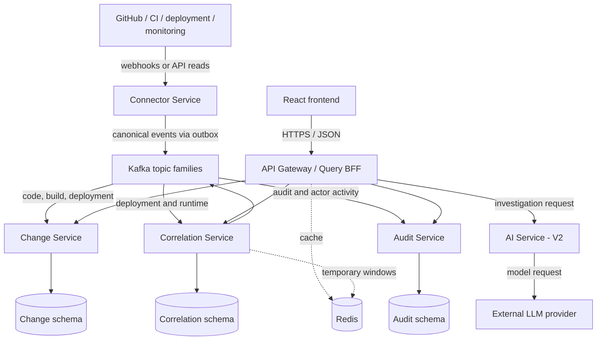

## 7.3 Frontend system

**Status: partial.** React composes the theme, query provider, router, and persistent
layout. Overview renders product guidance; Changes, Services, and Activity are
placeholder routes. The GET transport and query defaults exist, while feature
queries and the BFF are planned. The [frontend README](frontend/README.md) diagrams
each internal boundary and its state ownership.

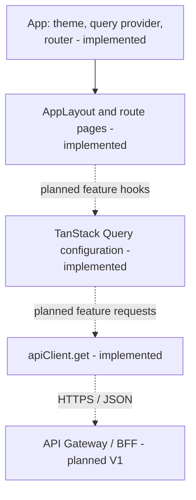

Frontend boundaries and browser-to-BFF data flow are documented in
[docs/architecture/frontend.md](docs/architecture/frontend.md).

---

# 8. Domain Model

The V1 domain should remain intentionally small.

## Core entities

```text
Organization
Service
Repository
PullRequest
Commit
Build
Deployment
ChangeRecord
ServiceHealthSignal
ChangeImpact
Actor
AIActor
AuditEvent
```

## Core relationship model

**Status: planned V1 domain.** An organization scopes services and their delivery
history. A change record links provider artifacts to a service and environment;
impact records connect deployments to observed health evidence. Actor attribution
and immutable audit history explain who performed or approved an activity.
Relationships below express domain associations, not finalized SQL cardinalities.

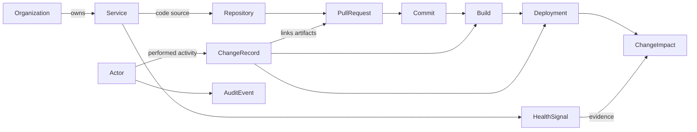

A `ChangeRecord` connects the important lifecycle artifacts.

Example:

```text
ChangeRecord
──────────────────────────
id
organizationId
serviceId
repositoryId
pullRequestId
commitId
buildId
deploymentId
actorType
deployedAt
environment
status
```

---

# 9. Event-Driven Architecture

**Status: planned V1 processing; the connector producer component and broker exist.**
REST serves interactive queries and configuration commands. Kafka carries durable
lifecycle facts so each consumer can update its own projection at its own pace.
An accepted ingestion request and a queryable timeline are separate milestones;
the UI must represent projection delay explicitly.

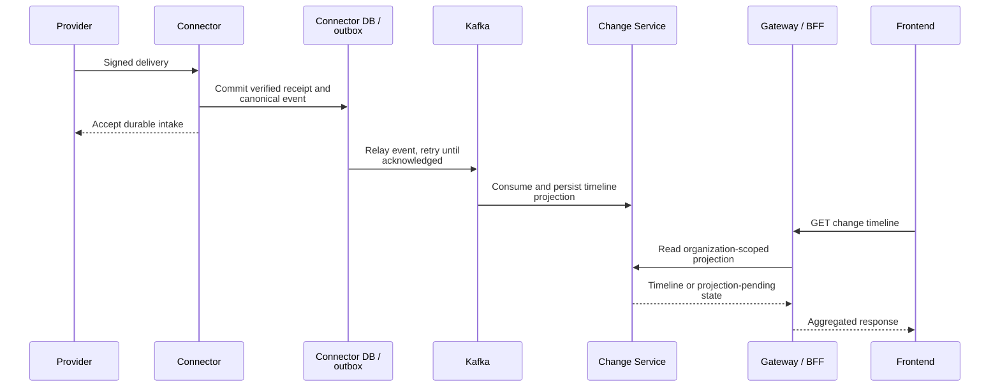

ChangeGuard is event-driven because software delivery itself is event-driven.

Examples:

```text
PR merged
Build completed
Deployment completed
Health degraded
Alert fired
AI action executed
Incident created
```

Internal services should communicate through events where asynchronous coupling is appropriate.

Synchronous REST should primarily be used for:

- user-facing queries
- administrative commands
- configuration
- authentication
- integration setup
- request/response interactions

Kafka should be used for:

- lifecycle events
- domain events
- derived events
- audit streams
- correlation processing
- asynchronous workflows

---

# 10. Kafka Design

**Status: partial.** Compose provides one KRaft node acting as broker and controller
with a persistent volume. `CodeEventProducer` publishes registered Avro to
`changeguard.code-events.v1` through the scheduled outbox relay; downstream consumers, other
topic families, retention policies, and schema enforcement are planned. Each
consumer group receives its own copy of a topic's records; consumers within a
group divide its partitions.

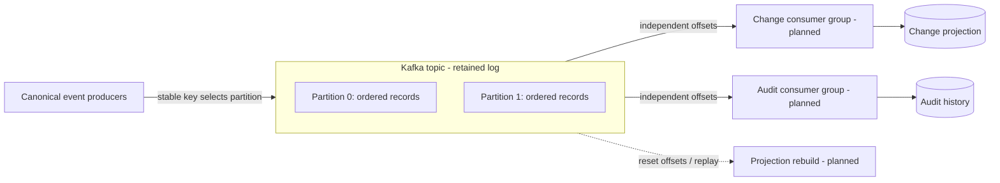

Ordering holds within a partition, not across all topics. The implemented code
publisher keys by **repository ID**; deployment/runtime events are intended to use
**service ID** where service ordering is required. Broker producer idempotence
does not replace application delivery deduplication.

Kafka is the durable event backbone.

Its purpose is not merely asynchronous messaging.

It provides:

- retention
- replay
- independent consumer groups
- ordered processing within partitions
- scalable consumers
- stream processing
- decoupled services
- historical reprocessing

## 10.1 Initial topics

Recommended V1 topics:

```text
changeguard.code-events.v1
changeguard.build-events
changeguard.deployment-events
changeguard.runtime-events
changeguard.ai-events
changeguard.correlation-events
changeguard.audit-events
```

Avoid creating a topic per event type.

Use typed events within bounded topic families.

## 10.2 Event keys

Use stable keys.

Examples:

```text
serviceId
repositoryId
deploymentId
```

For most lifecycle events, prefer:

```text
key = serviceId
```

This helps preserve ordering for a service timeline.

## 10.3 Partitioning

Example:

```text
changeguard.deployment-events

Partition 0 → checkout-service
Partition 1 → inventory-service
Partition 2 → user-service
```

Consumer groups allow horizontal scaling.

## 10.4 Consumer groups

Examples:

```text
change-service-group
correlation-service-group
audit-service-group
analytics-service-group
```

Each consumer group independently processes the same event stream.

## 10.5 Retention

Retention should be environment-specific.

Example approach:

```text
development:
short retention

staging:
medium retention

production:
long retention
```

Audit and lifecycle history may require significantly longer retention than transient operational topics.

## 10.6 Schema Registry

**Status: implemented for the V1 code-event catalog.** The shared module defines
`PullRequestOpened`, `PullRequestMerged`, and `CommitCreated`; the merged-PR
pipeline publishes registered Avro. Connector startup registers reviewed schemas
under `TopicRecordNameStrategy` subjects with `BACKWARD_TRANSITIVE` compatibility.
Serializers use exact schema lookup with automatic registration disabled.
See [shared contracts and evolution rules](backend/event-contracts/README.md) and
[Registry startup, storage, and verification](backend/docker/schema-registry/README.md).

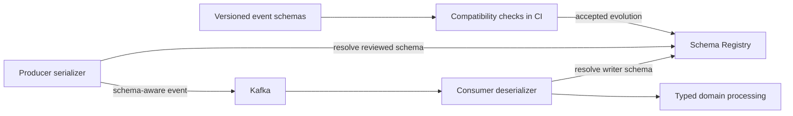

The implemented Kafka value format is:

```text
Apache Avro
+
Schema Registry
```

Goals:

- backward compatibility
- controlled evolution
- event versioning
- producer validation
- consumer safety

---

# 11. Canonical Event Model

**Status: implemented shared V1 code contracts and merged-PR adapter.**
`PullRequestMerged` is the finalized event name, with a stable event ID, trusted
organization/integration context, UTC microsecond timestamps, and typed merge
payload. The shared Avro schemas cover all three code-event types; opened-PR and
commit ingestion remain planned. The connector stores JSONB and publishes binary
Avro on `changeguard.code-events.v1`. Historical `CodeChangeMerged` outbox rows
are upcast without changing their stored envelope or identity; existing JSON
history remains on the earlier topic. See [the cutover guide](backend/event-contracts/README.md#legacy-event-cutover-subsystem).

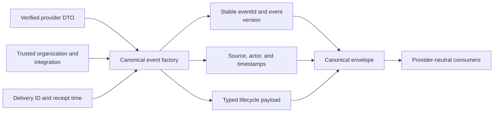

All internal events should share a standard envelope.

Example:

```json
{
  "eventId": "01J8X...",
  "eventType": "DeploymentCompleted",
  "eventVersion": 1,
  "occurredAt": "2026-10-01T19:14:00Z",
  "receivedAt": "2026-10-01T19:14:02Z",
  "organizationId": "org-123",
  "source": {
    "provider": "jenkins",
    "integrationId": "integration-55"
  },
  "actor": {
    "type": "HUMAN",
    "id": "user-88"
  },
  "correlation": {
    "traceId": "trace-abc",
    "changeId": "change-4821"
  },
  "payload": {}
}
```

## Example event types

### Code

```text
PullRequestOpened
PullRequestMerged
CommitCreated
```

### Build

```text
BuildStarted
BuildCompleted
BuildFailed
ArtifactCreated
```

### Deployment

```text
DeploymentStarted
DeploymentCompleted
DeploymentFailed
RollbackCompleted
```

### Runtime

```text
ServiceHealthDegraded
ServiceHealthRecovered
MetricThresholdExceeded
```

### AI

```text
AIActionExecuted
AIChangeProposed
AIChangeApproved
```

### Correlation

```text
ChangeImpactDetected
ChangeImpactCleared
```

---

# 12. Microservice Boundaries

V1 should use a small number of meaningful services.

Do not create dozens of tiny services.

## 12.1 Connector Service

**Status: partial.** The Connector Service owns the provider boundary: authenticate
raw deliveries, resolve trusted integration context, normalize supported activity,
and publish canonical events. The HTTP adapter, HMAC validator, merged-PR
normalizer, event record, and producer form an active merged-PR pipeline. The
processor resolves organization ownership from the stored GitHub installation,
checks active selected repositories, and commits durable receipts/outbox events
before returning `202`. The relay leases events and records success after Kafka
acknowledgement, with durable retries on failure. GitHub App setup APIs and other
event adapters remain planned. See the [backend subsystem diagrams](backend/README.md#connector-system-and-subsystems).

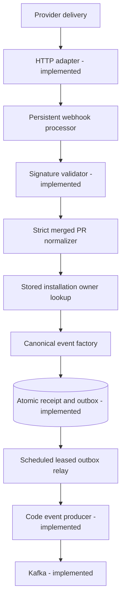

Responsibilities:

- receive webhooks
- call external APIs when needed
- verify webhook authenticity
- normalize provider payloads
- deduplicate inbound events
- publish canonical events

Initial connectors:

```text
GitHub
Jenkins / GitHub Actions
Prometheus
```

Future:

```text
GitLab
Bitbucket
Argo CD
Spinnaker
Kubernetes
Datadog
PagerDuty
Jira
ServiceNow
```

### 12.1.1 GitHub connection and repository selection

**Status: planned V1.** An authorized organization administrator installs the hosted
GitHub App and selects accessible repositories through ChangeGuard APIs. The
backend validates expiring, single-use callback state, persists organization-owned
installation metadata, and stops intake for disconnected or revoked integrations.
App keys and short-lived installation tokens stay server-side. Endpoint ownership
and persistence details are to be finalized in the [integration plan](docs/plans/github-repository-integration.md).

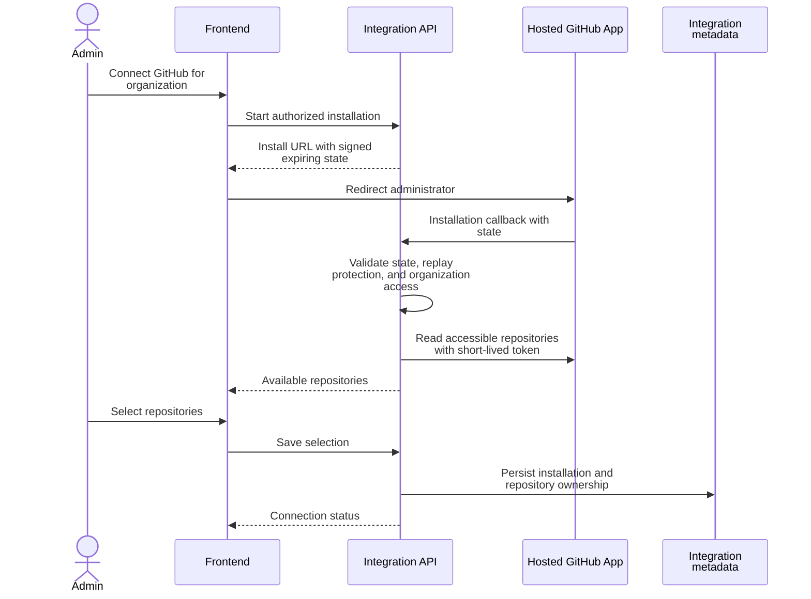

### 12.1.2 CI and build ingestion

**Status: planned V1.** A Jenkins or GitHub Actions adapter maps provider build
status, commit SHA, and artifact identity into the build-event family. The Change
Service links these facts to existing code records; the connector does not create
the cross-provider timeline itself.

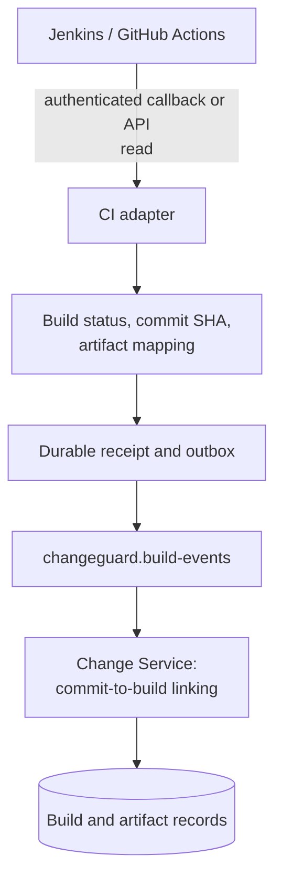

### 12.1.3 Deployment ingestion

**Status: planned V1.** Deployment adapters retain service, environment, artifact or
commit identity, result, and occurrence time. Canonical deployment events feed
both timeline projection and impact analysis; a successful CI build alone does
not establish that an artifact reached production.

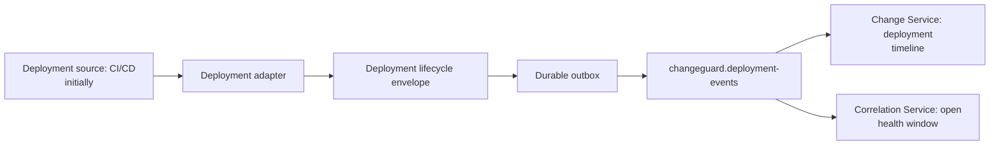

### 12.1.4 Runtime health ingestion

**Status: planned V1.** The Prometheus adapter maps metric samples and alert
activity to a known organization, service, and environment. It publishes runtime
facts for comparison with deployments. Provider monitoring remains the original
source; ChangeGuard stores the evidence needed to explain an impact assessment.

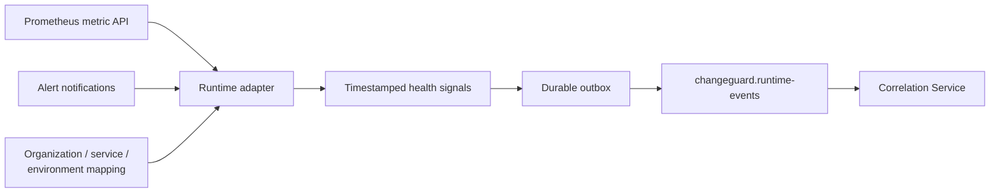

## 12.2 Change Service

**Status: planned V1.** This service turns code, build, and deployment facts into
queryable change records. It owns lifecycle relationships and its database schema.
Consumers deduplicate event IDs and commit projection updates with any outgoing
domain event in one transaction. Other services read its API rather than its tables.

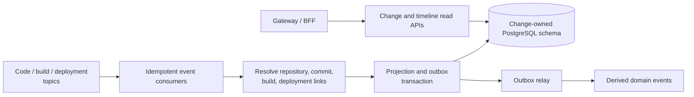

Responsibilities:

- build change records
- relate PRs, commits, builds, and deployments
- store current lifecycle state
- expose change APIs
- publish domain events

Owns:

```text
repository
pull request
commit
build
deployment
change record
```

## 12.3 Correlation Service

**Status: planned V1.** The service joins deployments with runtime observations
for the same service and environment. It owns durable impact/evidence records,
uses temporary window state where useful, and publishes impact events for other
consumers. [Section 17](#17-correlation-engine) details the assessment algorithm.

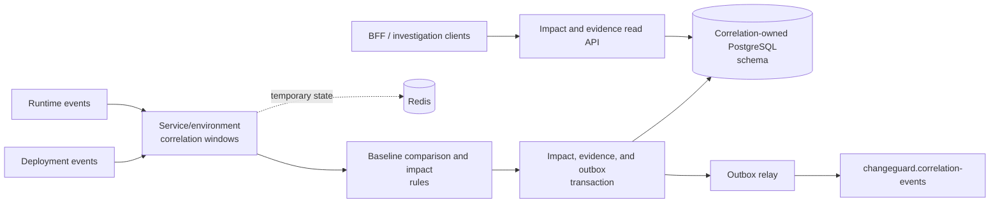

Responsibilities:

- consume deployment events
- consume runtime events
- maintain correlation windows
- compare pre/post-deployment health
- calculate change impact
- publish impact events

Potential implementation:

```text
Spring Boot
+
Kafka Streams
```

## 12.4 Audit Service

**Status: planned V1.** The Audit Service appends attributed activity and approval
history. Replayed events must not create additional audit entries. Its normal
application API exposes reads rather than edits; actor type and AI metadata must
come from explicit evidence rather than guesses based on a provider username.

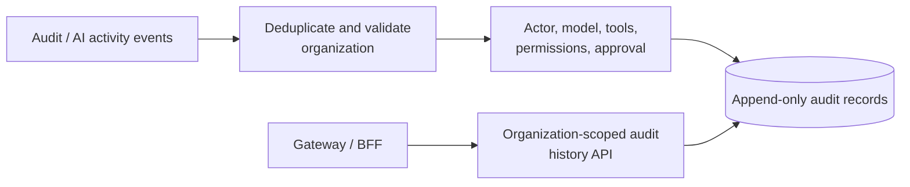

Responsibilities:

- append audit records
- track actor identity
- track AI participation
- store approval metadata
- expose audit history

Audit records should be immutable from normal application workflows.

## 12.5 Query/BFF Service

**Status: planned V1.** The Gateway authenticates and routes browser requests; the
BFF composes frontend read models from service APIs. They may be one V1 deployment.
The BFF owns response composition and optional caching, while domain services own
business data. It should preserve partial/pending states when projections lag.

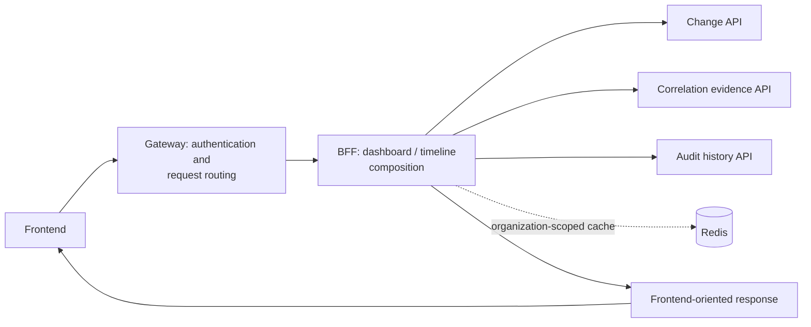

Responsibilities:

- frontend-oriented APIs
- aggregate read models
- reduce frontend orchestration
- expose dashboard queries

V1 may combine this responsibility with the API gateway if simplicity is preferred.

## 12.6 AI Service — V2

**Status: planned V2.** A Python/FastAPI service gathers authorized internal
evidence, calls a configured LLM, and returns a cited explanation or action
proposal. Investigations must retain evidence references and record model/tool
activity. Proposed actions enter the approval workflow; model output alone cannot
authorize production changes.

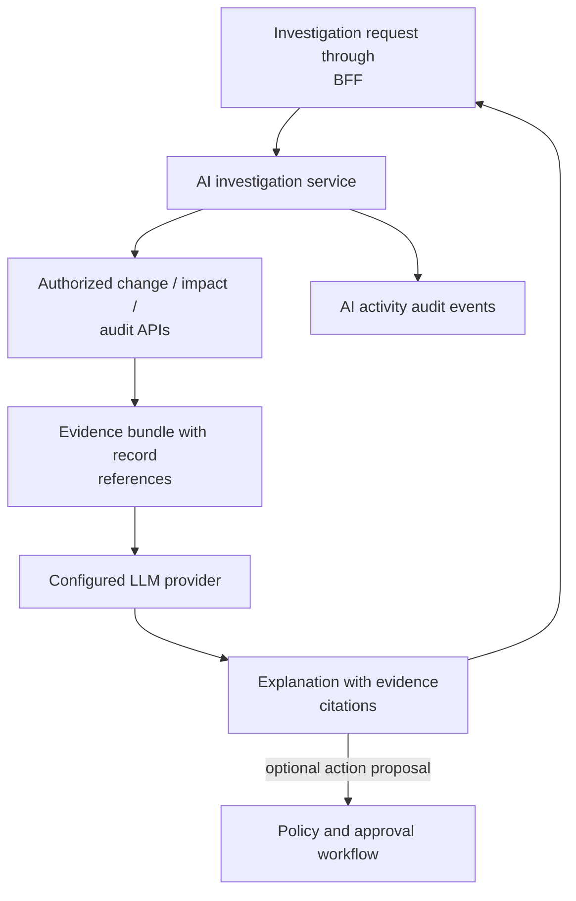

Responsibilities:

- summarize investigations
- generate evidence-based explanations
- correlate contextual information
- produce recommended actions
- interact with external LLMs

The AI service should not directly modify production systems.

All actions must pass through platform policy and approval boundaries.

---

# 13. Database Strategy

PostgreSQL is the primary system of record.

V1 does not require a graph database.

Relationships should initially be modeled relationally.

## Recommended database ownership

Each service should conceptually own its data.

Avoid direct database access across services.

Example:

**Status: connector persistence implemented; downstream schemas planned V1.**
Services can share an early PostgreSQL cluster while retaining separate schema
ownership. The connector uses Flyway migrations and Spring JDBC for installation,
selected repository, receipt, and outbox storage. Cross-service reads use APIs or
event-fed projections; the diagram's arrows represent exclusive write ownership.

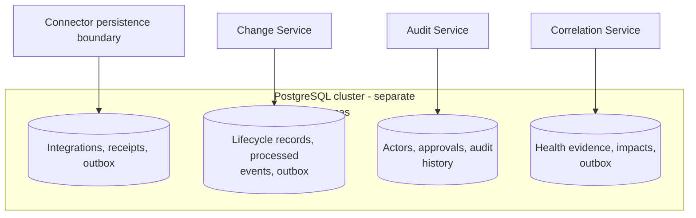

For early development, these may run in the same PostgreSQL cluster while maintaining ownership boundaries.

## Example tables

```text
organizations
services
repositories
pull_requests
commits
builds
deployments
change_records
health_signals
change_impacts
actors
ai_actors
audit_events
outbox_events
processed_events
```

---

# 14. Redis Strategy

**Status: planned V1.** Redis accelerates reads and holds bounded temporary state.
Cache keys and window keys must include organization and relevant service or
environment scope, with explicit TTLs. Durable change, audit, and deduplication
records remain in PostgreSQL; a cache miss can be recovered from the owning service.

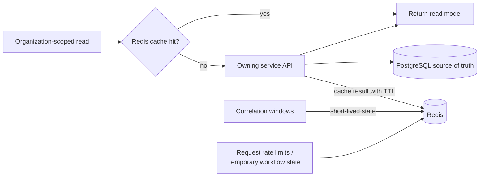

Redis is not the primary database.

Use Redis for:

- cache
- rate limiting
- short-lived state
- idempotency keys
- deduplication
- distributed locks
- recent-deployment lookup
- correlation windows
- temporary workflow state

Example:

```text
key:
recent-deployment:checkout-service

value:
deploy-4821

TTL:
30 minutes
```

PostgreSQL remains the source of durable business truth.

---

# 15. Transactional Outbox

Never depend on:

```text
write database
then
publish Kafka event
```

as two independent operations.

Failure example:

```text
database commit succeeded
Kafka publish failed
```

The system becomes inconsistent.

Use a transactional outbox.

**Status: connector atomic intake and publication relay implemented; other services planned V1.**
Commit business state and the outgoing event together.
A relay marks the outbox row sent only after Kafka acknowledgement. A crash after
publication but before marking can resend the event, so stable event IDs and
idempotent consumers remain required. `ConnectorIntakeStore` already commits a
verified merged-change receipt and canonical JSONB outbox event together. HTTP
returns `202` after that commit. The scheduled relay claims due rows using
`FOR UPDATE SKIP LOCKED`, fences updates with lease tokens, and persists capped
exponential backoff. Expired leases recover interrupted workers; publication is
at-least-once. See [relay configuration and recovery](backend/README.md#outbox-relay).

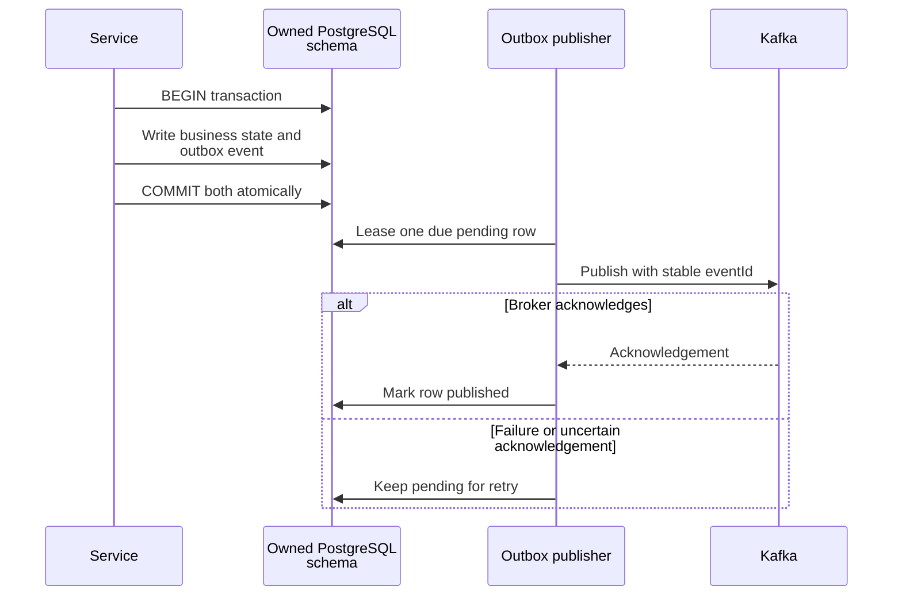

Later, CDC may be introduced:

**Status: future alternative relay.** Debezium can stream committed outbox changes
from the PostgreSQL transaction log into Kafka. It replaces polling publication,
not the atomic outbox write or consumer deduplication requirements.

```mermaid
flowchart LR
    TX["Business + outbox transaction"] --> DB[("PostgreSQL")]
    DB -->|"committed transaction log"| CDC["Debezium CDC"]
    CDC -->|"outbox event routing"| Kafka["Kafka"]
    Kafka --> Consumer["Idempotent consumers"]
```

---

# 16. Idempotency and Delivery Semantics

Consumers must assume duplicate delivery is possible.

Each event has:

```text
eventId
```

Consumers record processed IDs.

Example:

```text
processed_events
────────────────────────
consumer
event_id
processed_at
```

Before processing:

**Status: planned V1 durable delivery semantics.** Use a unique consumer/event ID
record and commit it atomically with business effects. Commit the Kafka offset
after the database transaction succeeds. A crash before offset commit may cause
redelivery, which the stored ID safely absorbs. Stable IDs exist in the current
event factory. Durable connector receipts now deduplicate by integration and
delivery ID, including concurrent intake. Downstream consumer deduplication is planned.

```mermaid
flowchart TD
    Event["Receive event"] --> TX["Begin owned database<br/>transaction"]
    TX --> Claim{"Claim unique consumer +<br/>eventId?"}
    Claim -->|"already committed"| Skip["No repeated business effect"]
    Claim -->|"new event"| Apply["Apply projection / audit /<br/>outbox effects"]
    Apply --> Commit["Commit effects and processed<br/>ID together"]
    Apply -->|"failure"| Rollback["Roll back effects and<br/>processed ID"]
    Rollback --> Retry["Retry or dead-letter policy"]
    Skip --> Offset["Commit consumer offset"]
    Commit --> Offset
```

This protects against duplicate:

- deployments
- correlations
- audits
- notifications

---

# 17. Correlation Engine

The correlation engine is central to ChangeGuard.

V1 correlation can initially be rules-based.

Example:

**Status: planned V1.** Compare a deployment's post-release health with the same
service/environment baseline. Window lengths and thresholds are configurable
design choices; fifteen minutes below is an example. Store observed deltas and
timing as evidence. Temporal correlation suggests an impact, not proven causation;
insufficient baseline or signal coverage should produce `UNKNOWN`.

```mermaid
flowchart TD
    Deployment["DeploymentCompleted"] --> Scope["Match organization, service,<br/>environment"]
    Runtime["Timestamped runtime signals"] --> Scope
    Scope --> Windows["Before/after windows, e.g.<br/>15-minute observation"]
    Windows --> Coverage{"Enough baseline and<br/>post-deploy data?"}
    Coverage -->|"no"| Unknown["UNKNOWN with missing evidence"]
    Coverage -->|"yes"| Compare["Compare error rate, latency,<br/>restarts, availability"]
    Compare --> Assess["Impact type, confidence, and<br/>observed deltas"]
    Assess --> Persist["Persist evidence and<br/>assessment"]
    Unknown --> Persist
    Persist --> Publish["Publish impact event through<br/>outbox"]
```

## Baseline comparison

A deployment should be evaluated against a baseline.

Example:

```text
before deployment:
error rate = 0.4%
p95 latency = 220ms

after deployment:
error rate = 6.8%
p95 latency = 890ms
```

## Initial signals

Potential V1 metrics:

- HTTP 5xx rate
- request latency
- restart count
- service availability
- CPU saturation
- memory saturation

Do not correlate every metric initially.

Start with a small reliable set.

## Impact model

Example:

```text
ChangeImpact
────────────────────
changeId
serviceId
impactType
confidence
detectedAt
windowStart
windowEnd
evidence
status
```

Impact types:

```text
NO_SIGNIFICANT_IMPACT
POSSIBLE_NEGATIVE_IMPACT
LIKELY_NEGATIVE_IMPACT
RECOVERED
UNKNOWN
```

---

# 18. AI Audit Model

**Status: planned V1 audit foundation, extended in V2.** Explicit actor metadata
links an engineering action to human/AI participation, model identity, tools,
permissions, and approval. The current GitHub factory records a known login with
actor type `UNKNOWN`; it does not yet establish AI involvement. Unknown fields
must remain unknown until an authoritative source supplies them.

```mermaid
flowchart LR
    Identity["Human / AI / unknown actor<br/>identity"] --> Action["Attributed engineering action"]
    Model["AI agent and model metadata<br/>when known"] --> Action
    Tools["Tools and permissions used"] --> Action
    Approval["Approver and approval status"] --> Action
    Action --> Event["Versioned activity / audit<br/>event"]
    Event --> Audit["Audit Service append"]
    Audit --> Change["Linked change and audit<br/>history"]
```

AI involvement should be modeled explicitly.

Example:

```text
AIActor
────────────────────────
id
provider
agentName
modelProvider
modelName
modelVersion
```

Example action:

```text
AIAction
────────────────────────
id
actorId
organizationId
repositoryId
pullRequestId
actionType
toolsUsed
permissionsUsed
approvedBy
approvalStatus
createdAt
```

Possible action types:

```text
CODE_GENERATION
CODE_REVIEW
TEST_GENERATION
INFRA_CHANGE
DEPLOYMENT_PROPOSAL
INCIDENT_ANALYSIS
REMEDIATION_PROPOSAL
```

---

# 19. API Design

**Status: planned V1 API surface, except the implemented GitHub webhook adapter.**
Browser queries use the Gateway/BFF and organization-authorized service APIs.
Integration commands configure ingestion, while provider webhooks enter the
connector through a separate signature-authenticated route. The listed GET and
integration-setup endpoints are target contracts, not available implementations.

```mermaid
flowchart LR
    Browser["Browser"] -->|"versioned HTTPS requests"| Gateway["Gateway / BFF"]
    Gateway -->|"dashboard and timeline reads"| Read["Change / correlation / audit<br/>APIs"]
    Gateway -->|"connect / configure"| Setup["Integration configuration APIs"]
    Provider["GitHub delivery"] -->|"POST<br/>/api/v1/integrations/github/webhook"| Webhook["Connector webhook adapter -<br/>implemented"]
    Webhook --> Processor["Signature-authenticated<br/>persistent processor"]
```

Start with REST.

Example endpoints:

```text
GET /api/v1/services
GET /api/v1/services/{id}

GET /api/v1/changes
GET /api/v1/changes/{id}

GET /api/v1/deployments
GET /api/v1/deployments/{id}

GET /api/v1/changes/{id}/impact
GET /api/v1/changes/{id}/timeline

GET /api/v1/audit/events

POST /api/v1/integrations/github
POST /api/v1/integrations/jenkins
POST /api/v1/integrations/prometheus
```

Version all APIs.

```text
/api/v1
```

---

# 20. Security

**Status: partial.** The connector currently uses stateless HTTP Basic, public
health reads, and a public webhook POST with CSRF exemption. Its HMAC component
exists but is not yet wired into processing. OAuth2/JWT, RBAC, tenant isolation,
rate limits, and managed secret storage below are target platform boundaries.
Browser identity and provider-delivery authenticity are distinct checks.

```mermaid
flowchart LR
    User["User / browser"] --> Identity["OAuth2 / OIDC identity -<br/>planned"]
    Identity --> Gateway["Gateway token validation and<br/>rate limits - planned"]
    Gateway --> AuthZ["Organization and role<br/>authorization - planned"]
    AuthZ --> APIs["Scoped domain APIs"]
    Provider["Provider webhook"] --> HMAC["Verify raw-byte signature -<br/>component implemented"]
    HMAC --> Integration["Trusted integration ownership<br/>- planned"]
    Integration --> Ingest["Allowed repository / event<br/>intake"]
    Secrets["Managed secrets, encrypted<br/>with KMS - planned"] -.-> HMAC
    Secrets -.-> ExternalAPI["Least-privilege provider API<br/>clients"]
    APIs --> Audit["Security activity audit -<br/>planned"]
    Ingest --> Audit
```

Security must be built into the architecture early.

## V1

- TLS everywhere
- JWT/OAuth2 authentication
- RBAC
- encrypted secrets
- webhook signature verification
- database encryption at rest
- audit logging
- least-privilege connector permissions
- rate limiting

## V2

- enterprise SSO
- OIDC
- SAML
- SCIM
- finer-grained authorization
- organization isolation
- service-account identities
- agent permissions
- approval workflows
- policy engine
- secret rotation
- tenant-aware encryption boundaries

## Integration credentials

Never store raw provider credentials in source control.

Use:

```text
AWS Secrets Manager
or
Kubernetes Secrets + KMS
```

depending on environment.

---

# 21. Observability

**Status: partial.** Connector health/info endpoints and logging exist. Prometheus
export requires the missing registry dependency; Prometheus, Grafana, Loki, and
OpenTelemetry infrastructure are planned. Monitoring ChangeGuard itself is
separate from ingesting customer-service health for change correlation. Trace and
event identifiers should connect both synchronous calls and asynchronous processing.

```mermaid
flowchart LR
    Services["ChangeGuard services"] -->|"metrics scrape"| Prometheus["Prometheus - planned"]
    Services -->|"structured logs"| Loki["Loki - planned"]
    Services -->|"OpenTelemetry spans"| Collector["OTel collector - planned"]
    Collector --> Traces["Trace storage - choice pending"]
    Prometheus --> Grafana["Grafana dashboards - planned"]
    Loki --> Grafana
    Traces --> Grafana
    Prometheus --> Alerts["Operational alerts: lag,<br/>failures, outbox age"]
    Probes["Container / platform health<br/>probes"] -->|"health endpoint - implemented<br/>for connector"| Services
```

ChangeGuard should observe itself from the beginning.

Every service should expose:

```text
/actuator/health
/actuator/prometheus
```

Metrics should include:

- request latency
- error rate
- Kafka consumer lag
- producer failures
- consumer failures
- retry count
- dead-letter count
- event processing latency
- correlation duration
- DB latency
- cache hit ratio
- external integration failures

## Distributed tracing

Use OpenTelemetry.

A lifecycle event should preserve trace/correlation identifiers.

Example:

```text
GitHub webhook
   ↓
Connector
   ↓
Kafka
   ↓
Change Service
   ↓
Correlation Service
```

The trace should remain discoverable across the flow.

## Logging

Use structured logs.

Recommended format:

```json
{
  "timestamp": "...",
  "service": "correlation-service",
  "level": "INFO",
  "traceId": "...",
  "eventId": "...",
  "organizationId": "...",
  "message": "Change impact detected"
}
```

Avoid unstructured production logs.

---

# 22. Reliability and Resilience

Services must tolerate partial failures.

Patterns:

- timeouts
- retries with backoff
- circuit breakers
- bulkheads where appropriate
- dead-letter topics
- idempotent consumers
- transactional outbox
- health checks
- graceful shutdown
- backpressure awareness

## Retry strategy

Not every failure should be retried forever.

Example:

**Status: planned V1 recovery workflow.** Classify errors before retrying. Retry
transient failures with bounded backoff; retain permanent or exhausted failures
for inspection and controlled replay. Preserve event identity on replay so the
same idempotency checks protect business effects. The connector already persists
outbox retries with capped backoff and recovers expired worker leases. It retries
pending publication until acknowledgement; retry budgets, application retry topics,
dead-letter handling, and circuit breakers remain planned.

```mermaid
flowchart TD
    Failure["Processing failure"] --> Type{"Transient failure?"}
    Type -->|"no: invalid contract /<br/>permanent error"| DLT["Dead-letter record with<br/>failure metadata"]
    Type -->|"yes"| Budget{"Retry budget available?"}
    Budget -->|"yes"| Backoff["Delay with bounded backoff"]
    Backoff --> Process["Retry idempotent processing"]
    Process -->|"failure"| Failure
    Process -->|"success"| Commit["Commit processing result"]
    Budget -->|"no"| DLT
    DLT --> Inspect["Inspect and fix cause"]
    Inspect -->|"controlled replay, same<br/>eventId"| Process
```

Permanent validation errors should fail fast.

---

# 23. Local Development

**Status: implemented four-container stack.** Vite serves the browser on 5173,
the connector exposes HTTP on 8081, Kafka exposes a host listener on 9092, and
PostgreSQL binds to localhost:5432. Containers use `kafka:9092` and `postgres:5432`;
the connector starts after both dependencies are healthy and runs Flyway migrations.
Named Kafka/PostgreSQL volumes retain records across restarts. The frontend currently
renders its shell without an API connection; additional local services below are
planned. Signed merged-PR webhook traffic reaches Kafka through the durable outbox relay.

```mermaid
flowchart LR
    Browser["Host browser"] -->|"localhost:5173"| Frontend["frontend: Vite"]
    Client["Host curl / webhook fixture"] -->|"localhost:8081"| Connector["connector-service: Spring Boot"]
    KafkaClient["Host Kafka client"] -->|"localhost:9092 / external<br/>listener"| Kafka["kafka: broker + KRaft<br/>controller"]
    Connector -.->|"configured producer:<br/>kafka:9092"| Kafka
    Kafka --> Volume[("kafka_data named volume")]
    Kafka -.->|"health gates connector startup"| Connector
    Connector -->|"JDBC / Flyway"| Postgres["postgres: connector-owned schema"]
    Postgres --> DatabaseVolume[("postgres_data named volume")]
    Postgres -.->|"health gates startup"| Connector
```

Local development should be possible with Docker Compose.

Run the frontend, Connector Service, Kafka, and PostgreSQL from the repository root with:

```sh
docker compose up --build
```

Then open <http://localhost:5173>. The connector's health endpoint is
<http://localhost:8081/actuator/health>, and Kafka is available on localhost:9092.
The [Compose file](docker-compose.yaml) waits for Kafka and PostgreSQL health before starting
the connector. If port 5173 is in use, start it with
`FRONTEND_PORT=5174 docker compose up --build` and open <http://localhost:5174>.
Stop the app with `Ctrl+C`, or run `docker compose down`.

Set `CONNECTOR_PORT`, `KAFKA_PORT`, or `POSTGRES_PORT` to change the other host ports.
The [.env.example](.env.example) lists development settings. Kafka and database
data are retained in named volumes. To start only the connector and its dependencies,
use `docker compose up --build --wait connector-service`.

Compose builds a [patched Kafka image](backend/docker/kafka/README.md) with
pinned Jackson and libexpat fixes. Backend CI verifies message production and
consumption and scans this same image.

The Connector Service can also run separately with Maven. See the
[backend documentation](backend/README.md) for Java prerequisites, run and test
commands, configuration, and current webhook behavior.

Recommended services:

```text
frontend
api-gateway
connector-service
change-service
correlation-service
audit-service
postgres
redis
kafka
schema-registry
prometheus
grafana
```

Optional local AI service in V2.

---

# 24. Repository Structure

Recommended monorepo:

```text
changeguard/
│
├── frontend/
│   ├── src/
│   │   ├── app/
│   │   │   ├── App.tsx
│   │   │   ├── AppRoutes.tsx
│   │   │   ├── queryClient.ts
│   │   │   └── theme.ts
│   │   ├── components/layout/AppLayout.tsx
│   │   ├── features/overview/OverviewQuestions.tsx
│   │   ├── hooks/usePageTitle.ts
│   │   ├── pages/
│   │   ├── services/apiClient.ts
│   │   └── types/navigation.ts
│   ├── .env.example
│   ├── README.md
│   ├── index.html
│   ├── package.json
│   ├── vite.config.ts
│   └── Dockerfile
│
├── backend/
│   ├── services/
│   │   ├── connector-service/
│   │   ├── change-service/
│   │   ├── correlation-service/
│   │   ├── audit-service/
│   │   ├── query-service/
│   │   └── ai-service/              # V2
│   │
│   ├── shared/
│   │   ├── event-contracts/
│   │   ├── observability/
│   │   ├── security/
│   │   └── testing/
│   │
│   └── pom.xml
│
├── event-schemas/
│   ├── code/
│   ├── build/
│   ├── deployment/
│   ├── runtime/
│   ├── ai/
│   └── correlation/
│
├── infrastructure/
│   ├── docker/
│   ├── kubernetes/
│   ├── terraform/
│   ├── kafka/
│   ├── observability/
│   └── aws/
│
├── docs/
│   ├── architecture/
│   │   └── frontend.md
│   ├── adr/
│   ├── api/
│   ├── event-catalog/
│   ├── security/
│   └── runbooks/
│
├── scripts/
│
├── docker-compose.yaml
├── Makefile
├── README.md
└── LICENSE
```

---

# 25. CI/CD

Each service should have independent build and test stages.

Example pipeline:

**Status: implemented CI verification; publishing and deployment are planned.**
Frontend and backend workflows independently run component checks, source and
dependency scans, conditional CodeQL, and container smoke/security checks. These
jobs are parallel gates, not one serial pipeline. Current workflows retain test
and security artifacts; they do not publish application images or deploy staging.

```mermaid
flowchart TD
    Trigger["PR / push / weekly schedule /<br/>manual run"] --> Workflow["Frontend or backend workflow"]
    Workflow --> Checks["Frontend: lint, types, tests,<br/>build / backend: Maven verify"]
    Workflow --> SAST["Pinned Semgrep source scan"]
    Workflow --> Dependencies["Trivy dependency / secret /<br/>config; frontend npm audit"]
    Workflow --> CodeQL["CodeQL when repository<br/>supports it"]
    Workflow --> Container["Docker build, startup smoke,<br/>image scan"]
    Container --> KafkaTest["Backend also verifies Kafka<br/>message round trip"]
    Container --> PostgresTest["Backend verifies PostgreSQL<br/>schema migrations"]
    Checks --> Reports["Retained test and scan<br/>artifacts"]
    SAST --> Reports
    Dependencies --> Reports
    CodeQL --> Reports
    Container --> Reports
    Reports -.-> Delivery["Planned: publish images,<br/>deploy staging, smoke test"]
```

Recommended tools may include:

```text
GitHub Actions
Maven
JUnit
Testcontainers
SonarQube
Trivy
Docker
Kubernetes
Terraform
```

GitHub Actions workflows are maintained independently at
`.github/workflows/frontend_ci.yml` and `.github/workflows/backend_ci.yml`.
Frontend CI runs lint, TypeScript checks, all unit and integration tests, and the
production build. Backend CI verifies the `backend/pom.xml` reactor on Java 21,
including shared Avro contracts and the Connector Service. Both workflows have
independent Semgrep source scans, dependency/secret/configuration scanning, and container
build/startup/security checks. Frontend dependency checks also use `npm audit`;
container scans cover runtime dependencies and operating-system packages.
HIGH/CRITICAL npm audit and Trivy findings fail CI. Reports are retained as
artifacts. Backend Trivy scans also print package, CVE, installed/fixed-version,
and secret-rule/location summaries in job logs without printing matched secrets.
PostgreSQL runtime scans use the hardened local image described in
[its build and verification diagrams](backend/docker/postgres/README.md).
Semgrep fails on source findings or scanner errors and retains JSON
and SARIF reports as `backend-sast` and `frontend-sast`. Its scanner image is
pinned by version and digest, and its Java/Spring and JavaScript/TypeScript/React
rules are checked out at a fixed upstream commit. Scans run with network access
disabled and do not require a Semgrep account. Actions are pinned to commit IDs.
Component/workflow/Compose changes trigger checks, with
weekly runs to refresh security results.

CodeQL is an additional scan that runs automatically on public repositories.
For private repositories, GitHub requires
[GitHub Code Security to be enabled](https://docs.github.com/en/code-security/reference/code-scanning/troubleshoot-analysis-errors/advanced-security-must-be-enabled).
To enable the private-repository CodeQL jobs, first enable Code Security under
repository **Settings → Security and quality → Advanced Security**, then add
`CODEQL_ENABLED` with value `true` under **Settings → Secrets and variables →
Actions → Variables**. Leave this variable unset when Code Security is
unavailable; CodeQL is skipped and Semgrep, dependency, secret, configuration,
and container scans still run. Disabling SARIF upload alone does not remove
the [private-repository CodeQL license requirement](https://docs.github.com/en/code-security/concepts/code-scanning/codeql/codeql-cli).
When enabled, CodeQL publishes findings to GitHub code scanning and saves its
SARIF files as `backend-codeql` and `frontend-codeql` artifacts, even if the
results upload fails.

After changing these workflows, commit and push the changes to start a new CI
run. [Re-running an older run uses its original commit and ref](https://docs.github.com/en/actions/how-tos/manage-workflow-runs/re-run-workflows-and-jobs),
so it will not pick up a workflow fix from a newer commit.

CI runners, runtime images, and tool downloads use explicit versions. GitHub
Actions references are pinned to commit IDs, and frontend dependencies use
exact versions matching the lockfile.

| Runtime or CI tool | Pinned version |
| --- | --- |
| Ubuntu CI runner | `24.04` |
| Node.js | `24.21.0` |
| Eclipse Temurin | `21.0.12.1+1` |
| Alpine Docker base | `3.24` |
| Kafka | `4.2.2` (image `4.2.2-security.1`) |
| PostgreSQL | `18.6-alpine3.24` base digest pinned; local image `18.6-security.1` with `su-exec 0.3-r0` |
| Flyway / PostgreSQL JDBC / Testcontainers | `11.14.1` / `42.7.13` / `2.0.5` (Spring Boot BOM) |
| Avro / Schema Registry | `1.12.2` / `8.3.2` (local Registry `8.3.2-security.1`, HTTP Core `5.4.3`) |
| Connector Jackson BOMs | `2.21.7` (Flyway dependencies) / `3.1.7` (application mapper) |
| Kafka Jackson modules | `2.21.7` (annotations `2.21`) |
| Kafka libexpat | `2.8.5-r0` |
| CodeQL bundle | `2.27.1` |
| Semgrep CE | `1.179.0` (image digest pinned) |
| Semgrep rules | `a84ff9cc2453ca91d581380de4b8b3f272f6f4be` |
| Trivy | `0.70.0` |
| Docker Buildx | `0.37.1` |
| BuildKit | `0.33.1` |
| Dockerfile frontend | `1.27.1` |

Image tags are verified against the official
[Node image definitions](https://github.com/docker-library/official-images/blob/master/library/node)
and [Temurin image definitions](https://github.com/docker-library/official-images/blob/master/library/eclipse-temurin).
The build tooling versions follow the
[Buildx release](https://github.com/docker/buildx/releases/tag/v0.37.1) and
[BuildKit release](https://github.com/moby/buildkit/releases/tag/v0.33.1).

---

# 26. Deployment Strategy

**Status: planned V1 staging/production architecture; local Compose is implemented.**
The AWS direction uses Kubernetes/EKS for application containers and managed
Kafka, PostgreSQL, and Redis for state. ECR stores deployable images; managed
secrets and KMS protect connector credentials. Exact ingress, managed services,
backup policy, and infrastructure modules remain implementation decisions.

```mermaid
flowchart LR
    CI["Verified application images"] --> ECR["Amazon ECR"]
    ECR --> EKS["Kubernetes / Amazon EKS<br/>services"]
    Browser["Browser"] --> Ingress["TLS ingress / Gateway"]
    Ingress --> EKS
    Providers["Provider callbacks"] --> Ingress
    EKS --> Kafka["Managed Kafka: MSK or other<br/>provider"]
    EKS --> DB[("RDS PostgreSQL")]
    EKS --> Redis[("ElastiCache Redis")]
    Secrets["Secrets Manager + KMS"] -.-> EKS
    EKS --> Telemetry["Metrics, logs, traces"]
```

## V1

Recommended:

```text
Docker Compose
for local development

Kubernetes
for staging/production

AWS
for cloud deployment
```

## AWS direction

Potential architecture:

```text
Amazon EKS
Amazon MSK or managed Kafka provider
Amazon RDS PostgreSQL
Amazon ElastiCache Redis
Amazon ECR
AWS Secrets Manager
AWS KMS
Amazon S3
CloudWatch
```

Prometheus/Grafana may run via managed or self-managed deployment.

## Kafka production

Do not begin by self-hosting a complex Kafka cluster unless required.

Prefer:

```text
Amazon MSK
or
Confluent Cloud
```

for early production.

---

# 27. Testing Strategy

**Status: partial.** Frontend unit/route/API-client tests, backend component tests,
and real PostgreSQL migration/persistence tests run today, including signed HTTP
intake through the scheduled outbox relay to real Kafka and Schema Registry
containers, consuming generated Avro records and checking schema evolution.
Container startup, catalog readiness, and Kafka message smoke checks also run. Downstream
domain consumer integration, schema contracts, full lifecycle end-to-end,
and performance suites are planned. Each layer verifies a different boundary;
component mocks alone do not demonstrate a working ingestion-to-UI pipeline.

```mermaid
flowchart LR
    Unit["Implemented: unit and<br/>component contracts"] --> Integration["PostgreSQL and webhook-to-Kafka<br/>implemented; domain consumers / Redis planned"]
    Schema["Planned:<br/>producer-schema-consumer<br/>compatibility"] --> Integration
    Integration --> E2E["Planned: signed webhook to<br/>timeline and impact UI"]
    Smoke["Implemented: container health<br/>and Kafka round trip"] --> E2E
    E2E --> Load["Planned: throughput, lag, API<br/>and correlation latency"]
```

Testing must include more than unit tests.

## Unit tests

Examples:

- correlation rules
- event validation
- mapping logic
- domain services

## Integration tests

Use Testcontainers for:

```text
PostgreSQL
Kafka
Redis
```

## Contract tests

Validate:

```text
event producer
↕
event schema
↕
event consumer
```

Schema compatibility is a production concern.

## End-to-end tests

Example:

```text
GitHub webhook
    ↓
connector
    ↓
Kafka
    ↓
change service
    ↓
deployment event
    ↓
runtime signal
    ↓
correlation
    ↓
UI result
```

## Performance tests

Test:

- Kafka throughput
- consumer lag
- correlation latency
- API latency
- PostgreSQL query performance
- high-event-volume scenarios

---

# 28. V1 Delivery Plan

V1 should be built in stages.

## Phase 1 — Platform foundation

The monorepo, backend parent, frontend shell, Compose, PostgreSQL, Kafka, and
Schema Registry are implemented. Redis and the Prometheus/Grafana stack remain planned.

Build:

- monorepo structure
- Spring Boot parent project
- frontend shell
- Docker Compose
- PostgreSQL
- Redis
- Kafka
- Schema Registry
- basic observability

Completion criteria:

- all services start locally
- Kafka topic can accept a test event
- metrics visible in Prometheus
- basic dashboard visible in Grafana

## Phase 2 — Canonical event system

The shared code-event envelope, generated Avro records, Registry integration,
versioning rules, and merged-PR producer are implemented. Real wire tests verify
typed consumption and compatibility rejection. Service consumers and their
durable event deduplication remain to be built.

Build:

- event envelope
- Avro schemas
- schema registry integration
- producer library
- consumer library
- event versioning rules

Completion criteria:

- versioned events can be produced and consumed
- incompatible schema changes are rejected
- duplicate events are safely handled

## Phase 3 — GitHub integration

Build:

- webhook endpoint
- signature validation
- PR event normalization
- commit event normalization

Detailed, testable deliverables are tracked in
[docs/plans/github-repository-integration.md](docs/plans/github-repository-integration.md).

Completion criteria:

- merged PR appears as canonical code event
- event stored and visible in UI

## Phase 4 — CI integration

Build:

- Jenkins or GitHub Actions connector
- build event normalization
- commit-to-build linking

Completion criteria:

```text
PR
↓
Commit
↓
Build
```

can be reconstructed.

## Phase 5 — Deployment tracking

Build:

- deployment event model
- deployment persistence
- change record generation

Completion criteria:

```text
PR
↓
Commit
↓
Build
↓
Deployment
```

appears as one timeline.

## Phase 6 — Prometheus integration

Build:

- metric ingestion
- alert ingestion
- service mapping
- runtime event normalization

Completion criteria:

- health signals link to deployed services

## Phase 7 — Correlation engine

Build:

- recent-deployment windows
- baseline calculation
- change impact rules
- confidence model
- evidence persistence

Completion criteria:

- a simulated post-deployment regression creates `ChangeImpactDetected`

## Phase 8 — AI audit foundation

Build:

- human/AI actor distinction
- AI actor model
- model metadata
- approval metadata
- audit UI

Completion criteria:

- a change can show whether it was human-created, AI-assisted, or AI-generated

## V1 exit criteria

V1 is complete when a user can:

1. connect GitHub
2. connect Jenkins/GitHub Actions
3. connect Prometheus
4. observe a deployment timeline
5. see whether health changed after the deployment
6. view the evidence
7. identify the human or AI actor involved

---

# 29. V2 Delivery Plan

V2 expands from change correlation into operational intelligence.

## Phase 1 — Incident model

**Status: planned V2.** An incident records affected services, severity, and
start/resolve times within an organization. It is an input to correlation and
investigation, while the external incident provider remains its source. Storage
and API ownership are not yet assigned to a concrete service.

```mermaid
flowchart LR
    Provider["Incident source / connector"] --> Incident["Canonical incident identity<br/>and timestamps"]
    Scope["Organization, affected<br/>services, severity"] --> Incident
    Incident --> Store[("Incident records - owner to be<br/>decided")]
    Store --> Correlation["Incident-to-change correlation"]
    Store --> API["Incident read API / UI"]
```

Add:

```text
Incident
AffectedService
Severity
StartedAt
ResolvedAt
```

## Phase 2 — Incident correlation

**Status: planned V2.** Start with the incident's affected services and time window,
then retrieve recent deployments and traverse their build/commit/PR links. Rank
candidate changes using stored impact evidence; return candidates and rationale
instead of treating temporal proximity as proof of root cause.

```mermaid
flowchart LR
    Incident["Incident: affected service and<br/>start time"] --> Window["Recent deployment candidates"]
    Window --> Deployment["Deployment"]
    Deployment --> Build["Build / artifact"]
    Build --> Commit["Commit"]
    Commit --> PR["Pull request"]
    Window --> Rank["Rank candidates and explain<br/>evidence"]
    Impact["Health / impact evidence"] --> Rank
    PR --> Rank
    Rank --> Investigation["Incident investigation<br/>timeline"]
```

Correlate:

```text
Incident
   ↓
Service
   ↓
Deployment
   ↓
Build
   ↓
Commit
   ↓
PR
```

## Phase 3 — AI investigation service

**Status: planned V2.** The [AI Service diagram](#126-ai-service--v2) shows evidence
retrieval, model calls, cited explanations, audit activity, and action proposals.

Introduce:

```text
Python
FastAPI
```

Use it for:

- timeline summarization
- evidence explanation
- suspected cause analysis
- recommended investigation steps

Every AI answer should cite internal evidence.

## Phase 4 — Release intelligence

**Status: planned V2.** A release assessment combines test/build results, change
size, deployment history, reliability, incidents, and actor metadata. It returns
an evidence-backed recommendation before promotion. Assessment and deployment
authorization remain separate responsibilities.

```mermaid
flowchart LR
    Candidate["Release candidate"] --> Assessment["Release evidence assessment"]
    Tests["Build and test results"] --> Assessment
    History["Deployment history, incidents,<br/>service health"] --> Assessment
    Change["Change size and human / AI<br/>participation"] --> Assessment
    Assessment --> Result["Recommendation, confidence,<br/>evidence references"]
    Result --> UI["Release review UI"]
    Result --> Approval["Policy / approval workflow"]
```

Add evidence-based release analysis using:

- test status
- recent incidents
- service reliability
- deployment history
- change size
- AI involvement

## Phase 5 — Approval workflow

**Status: planned V2.** Proposals pass policy evaluation and service-owner approval
before an authorized executor performs a scoped, low-risk action. Rejected,
expired, or denied requests produce audit history without execution. The workflow
is a capability boundary; a separate deployment/service has not been selected.

```mermaid
flowchart TD
    Proposal["Action proposal and evidence"] --> Policy{"Policy permits this action?"}
    Policy -->|"no"| Denied["Record denial"]
    Policy -->|"yes"| Request["Create approval request"]
    Request --> Owner{"Authorized owner approves<br/>before expiry?"}
    Owner -->|"no"| Closed["Record rejection / expiration"]
    Owner -->|"yes"| Executor["Authorized executor performs<br/>scoped action"]
    Executor --> Result["Record outcome and<br/>verification"]
    Denied --> Audit["Immutable audit trail"]
    Closed --> Audit
    Result --> Audit
```

Add:

- approval requests
- service-owner approval
- audit trail
- low-risk action execution

## Phase 6 — More connectors

**Status: planned V2 / future provider expansion.** Each additional provider gets
an adapter behind the existing connector boundary, with its own authentication,
identity mapping, and fixture tests. Code providers map to code events;
deployment providers to deployment events; monitoring and incident providers to
their canonical domains. Jira/ServiceNow workflow events require contracts to be
defined before ingestion. Provider names below are candidates, not implemented integrations.

```mermaid
flowchart LR
    SCM["GitLab / Bitbucket"] --> Code["Code adapter"]
    Deploy["Argo CD / Spinnaker /<br/>Kubernetes"] --> Delivery["Deployment adapter"]
    Monitor["Grafana / Datadog"] --> Runtime["Runtime adapter"]
    Incident["PagerDuty"] --> IncidentAdapter["Incident adapter"]
    Work["Jira / ServiceNow"] --> Workflow["Workflow adapter - contract<br/>pending"]
    Code --> Intake["Shared authenticated, durable<br/>connector intake"]
    Delivery --> Intake
    Runtime --> Intake
    IncidentAdapter --> Intake
    Workflow --> Intake
    Intake --> Kafka["Canonical domain topic<br/>families"]
```

Potential additions:

```text
GitLab
Bitbucket
Argo CD
Kubernetes
Grafana
Datadog
PagerDuty
Jira
ServiceNow
```

Only add connectors that support validated workflows.

---

# 30. Future Evolution

Possible future platform capabilities:

## Software lifecycle graph

**Status: future.** Extend the relational lifecycle links into a navigable graph
from business initiative to remediation. The graph represents delivery provenance
and operational evidence; introducing it does not by itself require a graph database.

```mermaid
flowchart TD
    Initiative --> Service --> Repository --> Change --> Build --> Artifact
    Artifact --> Deployment --> Runtime --> Incident --> Remediation
```

## AI governance

**Status: future, building on V1 audit and V2 approvals.** Agent/model registries
identify participants; tool permissions and policy decide what they may do.
Approved execution records outcome, cost, and evaluation evidence for review.
The registry, policy, and evaluation implementations are not present.

```mermaid
flowchart TD
    Registry["Agent and model registries"] --> Request["Identified action request"]
    Request --> Policy["Tool authorization and<br/>permission policy"]
    Policy --> Approval["Required human approval"]
    Approval --> Execution["Authorized execution"]
    Execution --> History["Outcome, cost, and execution<br/>audit"]
    History --> Evaluation["Evaluation metrics and<br/>governance review"]
```

Potential capabilities:

- agent registry
- model registry
- tool authorization
- permission boundaries
- policy engine
- human approvals
- cost tracking
- execution history
- evaluation metrics

## Controlled remediation

Potential workflow:

**Status: future.** Investigation identifies candidate changes and produces a
remediation proposal. Policy and explicit approval gate execution. Post-action
health determines whether to close the investigation or gather more evidence;
all decisions and outcomes feed the audit trail.

```mermaid
flowchart TD
    Health["Health degradation"] --> Investigate["Investigate evidence and<br/>candidate deployment"]
    Investigate --> Proposal["Remediation proposal"]
    Proposal --> Approval{"Policy and human approval<br/>granted?"}
    Approval -->|"no"| Audit["Record decision and outcome"]
    Approval -->|"yes"| Execute["Execute authorized action"]
    Execute --> Verify{"Health recovered?"}
    Verify -->|"yes"| Close["Close investigation with<br/>evidence"]
    Verify -->|"no"| Investigate
    Execute --> Audit
    Close --> Audit
```

## Expanded delivery intelligence

**Status: future.** Independent analytics consumers build historical read models
from canonical lifecycle, impact, and audit events. Aggregations can expose change
failure trends, service regressions, actor participation, and team delivery
patterns through the BFF. Definitions and ownership of those metrics remain to be designed.

```mermaid
flowchart LR
    Events["Lifecycle / impact / audit<br/>streams"] --> Analytics["Replayable analytics<br/>projections"]
    Analytics --> Store[("Historical aggregates")]
    Store --> API["Analytics read APIs"]
    API --> BFF["Gateway / BFF"]
    BFF --> UI["Service, release, actor, and<br/>team trend views"]
```

Potential questions:

- Which deployment caused this incident?
- Which service is responsible for a customer-impacting failure?
- Which AI agent modified the affected code?
- Which changes have the highest failure rate?
- Which services repeatedly regress after releases?
- Which deployments are most likely to require rollback?
- Which engineering teams are experiencing the most delivery instability?

---

# 31. Non-Goals

V1 is not:

- a GitHub replacement
- a Jenkins replacement
- a Kubernetes replacement
- a Grafana replacement
- an incident-management replacement
- a project-management tool
- a full SDLC suite
- an autonomous production agent
- a general-purpose AI platform

The initial focus is narrow:

> **What changed? Did it hurt production? Who or what made the change?**

---

# 32. Engineering Standards

## Architecture

- Document each system and subsystem in its README with a Mermaid diagram,
  implementation status, purpose, inputs/outputs, and data ownership. Update
  diagrams when behavior or boundaries change; distinguish plans from working code.
- domain-driven boundaries
- event-first design
- explicit service ownership
- canonical schemas
- backward-compatible event evolution
- API versioning
- idempotent consumers
- transactional outbox
- infrastructure as code

## Code

- Java 21+
- Spring Boot conventions
- strict validation
- immutable event contracts
- structured logging
- automated formatting
- static analysis
- clear exception handling

## Operations

- health checks
- metrics
- traces
- alerts
- runbooks
- SLOs
- backups
- disaster recovery planning
- secret rotation

## Security

- least privilege
- zero-trust service assumptions
- encrypted communication
- immutable audit trails
- scoped integration tokens
- isolated tenant data
- policy-controlled production actions

---

# Final Product Thesis

ChangeGuard starts with a narrow, high-value workflow:

```text
Change
   ↓
Deployment
   ↓
Production Impact
   ↓
Human / AI Attribution
```

The foundation is intentionally designed for expansion.

The combination of:

```text
React + TypeScript + MUI
Java + Spring Boot
Apache Kafka
Kafka Streams
PostgreSQL
Redis
Prometheus
Grafana
OpenTelemetry
Docker
Kubernetes
Terraform
AWS
```

provides a modern, durable architecture for an event-driven software delivery intelligence platform.

The most important architectural asset is not the dashboard.

It is the canonical, replayable stream of software lifecycle events and the relationships ChangeGuard builds across them.

That event foundation allows the product to evolve from simple deployment correlation into release intelligence, incident investigation, AI-agent governance, and policy-controlled software-delivery automation.
