# ChangeGuard backend

The [backend Maven reactor](pom.xml) contains the
[shared event contracts](event-contracts/README.md), the
[Schema Registry runtime](docker/schema-registry/README.md), and the
[Connector Service](services/connector-service/pom.xml). It targets Java 21 and
uses Spring Boot 4.0.8 with Spring MVC, Spring Security, Spring for Apache Kafka,
Actuator, Spring JDBC, and Flyway. Its role is to receive external integration
events and publish normalized ChangeGuard events through a durable outbox.

The Maven configuration overrides Tomcat to 11.0.26, the Jackson 3 BOM to
3.1.7, and the Jackson 2 BOM to 2.21.7 to address dependency findings while retaining the current
Spring Boot release. See
[Tomcat's security fixes](https://tomcat.apache.org/security-11.html) and the
[Jackson advisory](https://github.com/FasterXML/jackson-databind/security/advisories/GHSA-cxp5-3px4-pw24).
Flyway introduces Jackson 2 independently of the application's Jackson 3 mapper;
both BOMs must therefore stay patched.

The HTTP adapter, configuration, signature validation component, merged pull
request normalizer, canonical merged change event, publisher, and PostgreSQL
persistence foundation are implemented. Flyway owns the `connector` schema;
integration metadata, selected repositories, receipts, and outbox records are durable.
Signed merged-PR deliveries now resolve the stored installation owner, commit an
accepted receipt and canonical event, and return `202`. A scheduled relay leases
pending events, publishes to Kafka, and marks publication after acknowledgement.
GitHub App setup APIs and downstream timeline consumers remain to be built.

## Connector system and subsystems

**Status: implemented merged-PR intake and publication; other adapters are planned.**
The HTTP path commits durable work independently of broker availability. The relay
uses that committed work to publish registered Avro on `changeguard.code-events.v1`.
The stored outbox envelope remains JSONB. The
[platform service diagrams](../README.md#12-microservice-boundaries) describe the
downstream Change, Correlation, Audit, Query/BFF, and V2 AI services, all still planned.

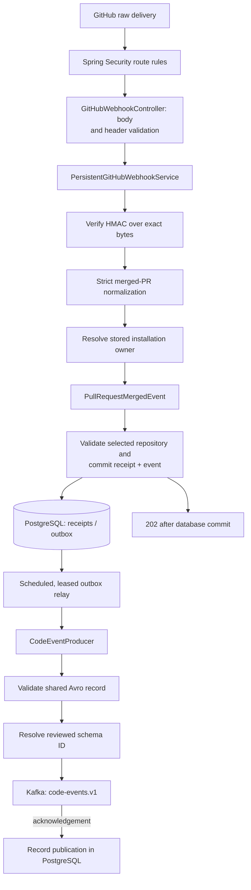

| Subsystem | Input and output | Status / detailed diagram |
| --- | --- | --- |
| HTTP intake | Raw JSON bytes and GitHub headers → validation status or processor call. | Implemented; [webhook API](#github-webhook-api) |
| Authenticity | Exact bytes and signature → HMAC validity. | Component implemented; [signature verification](#signature-verification) |
| Provider normalization | Verified activity → merged-PR DTO, ignored activity, or payload error. | Merged PRs implemented; [normalization](#github-event-normalization) |
| Canonical contract | DTO and trusted context → version-one event with stable identity. | Implemented; [event factory](#canonical-merged-change-event), [shared schemas](event-contracts/README.md) |
| Schema Registry | Reviewed schemas → compatibility policy and stable writer-schema IDs. | Implemented; [Registry](docker/schema-registry/README.md) |
| Kafka transport | Canonical event → repository-keyed Avro record and acknowledgement future. | Implemented; [publishing](#code-event-publishing) |
| Durable orchestration | Verified delivery → committed receipt/event; leased event → acknowledgement or durable retry. | Implemented; [outbox relay](#outbox-relay) |
| Connector persistence | Trusted integration/repository metadata and canonical events → scoped records and atomic receipt/outbox writes. | Implemented; [persistence](#connector-persistence) |
| Access rules and health | HTTP route → public or authenticated access and health/info. | Basic security/health implemented; [security and observability](#security-and-observability) |
| Container runtime and CI | Source/configuration → runnable service and verification reports. | Implemented; [Docker](#docker-development), [PostgreSQL runtime](docker/postgres/README.md), [platform CI](../README.md#25-cicd) |

## Local development

Install a Java 21 JDK and make it available through `JAVA_HOME` or `PATH`. The
service includes a Maven wrapper configured for Maven 3.9.16; its first run
downloads Maven and any uncached dependencies.

Start the local infrastructure from the repository root before running the connector:

```sh
docker compose up --build -d --wait postgres kafka schema-registry
```

Then, from the repository root:

```sh
cd backend/services/connector-service
./mvnw -f ../../pom.xml -pl event-contracts -am -DskipTests install
./mvnw spring-boot:run
```

On Windows, use `mvnw.cmd` in the same directory. With Maven already installed,
the equivalent command from the repository root is:

```sh
mvn -f backend/services/connector-service/pom.xml spring-boot:run
```

The default base URL is <http://localhost:8081>. Check application health with:

```sh
curl -i http://localhost:8081/actuator/health
```

Maven startup applies Flyway migrations and registers the reviewed catalog before
creating the Kafka producer. PostgreSQL and Schema Registry are required; the local
Registry uses Kafka for durable schema storage. No GitHub account is required for
startup. Health checks do not establish end-to-end webhook publication. Full-context
tests use PostgreSQL containers, and the wire test also starts Kafka and Registry;
focused unit/MVC tests use an in-memory Registry.

## Docker development

**Status: implemented.** Maven builds an executable JAR in the image build stage;
an unprivileged JRE runs it with externally supplied settings. Compose waits for
PostgreSQL, Kafka, and Registry health, mounts writable temporary storage, and uses an otherwise read-only
connector filesystem. Startup health does not verify end-to-end ingestion or publication.

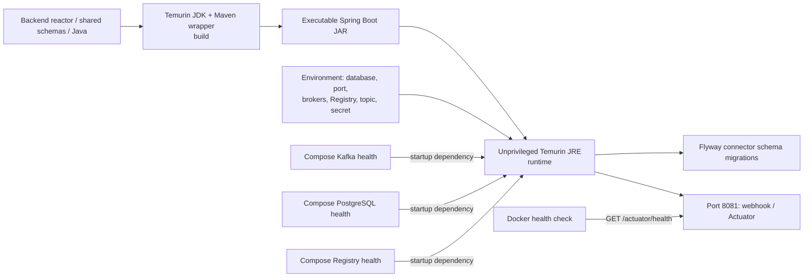

The repository's [Compose configuration](../docker-compose.yaml) runs the
frontend, Connector Service, PostgreSQL, Schema Registry, and a single-node Kafka broker:

```sh
docker compose up --build --wait
curl --fail http://localhost:8081/actuator/health
```

Run these commands from the repository root. To start only the connector and
its PostgreSQL/Kafka/Registry dependencies, use `docker compose up --build --wait connector-service`.
The frontend is available on port 5173, the connector on 8081, and Kafka on
localhost:9092. Override host ports with `FRONTEND_PORT`, `CONNECTOR_PORT`, and
`KAFKA_PORT`; PostgreSQL is bound to localhost on `POSTGRES_PORT` (default 5432).
Registry is available at localhost:8082, controlled by `SCHEMA_REGISTRY_PORT`;
containers use `http://schema-registry:8081`. Its schema history lives in Kafka's
compacted `_schemas` topic. See [Registry runtime diagrams](docker/schema-registry/README.md).
Containers use `postgres:5432` for database traffic and `kafka:9092` for broker traffic. The broker uses
plaintext listeners for local development and retains its data in the
`kafka_data` volume. Database records persist in `postgres_data`, mounted at
`/var/lib/postgresql` for PostgreSQL 18. Stop the stack with `docker compose down`;
this retains both data volumes. PostgreSQL uses the locally built
`changuard-postgres:18.6-security.1` image, based on the version/digest-pinned
official 18.6 Alpine image with its vulnerable privilege helper replaced. See
[PostgreSQL build, startup, and validation diagrams](docker/postgres/README.md).
`POSTGRES_IMAGE` can override the Compose image. See [.env.example](../.env.example) for local defaults.

Kafka uses the locally built `changuard-kafka:4.2.2-security.1` image, which
patches the upstream image's Jackson and libexpat vulnerabilities. All dependency
versions are pinned, and downloaded JARs are checked against their published
SHA-256 hashes. See the [Kafka image documentation](docker/kafka/README.md) for
the patches, JVM archive handling, and message smoke test. `KAFKA_IMAGE` can
override the local image tag.

Set `GITHUB_WEBHOOK_SECRET` in the root `.env` file or environment to override
the development placeholder. `CODE_EVENTS_TOPIC` can also be overridden.
Signed merge deliveries require an active stored installation and selected
repository. GitHub App setup APIs are pending; local test fixtures can seed those
bindings directly. A Kafka outage leaves accepted events pending for retry.

The service's [Dockerfile](services/connector-service/Dockerfile) pins Temurin
21.0.12.1+1 and Alpine 3.24 for its build and runtime stages. It builds the
executable JAR using the Maven wrapper, then runs it as an
unprivileged user in a JRE image. Its health check calls `/actuator/health`.
Compose gives the connector a read-only filesystem and writable temporary
storage, and waits for PostgreSQL, Kafka, and Registry health before starting it. Docker builds skip test
execution; the dedicated CI verification job runs the test suite.

## Build and test

Build the isolated-test runtime images once from the repository root:

```sh
docker compose build postgres kafka schema-registry
```

Then run these commands from `backend/services/connector-service`:

| Command | Purpose |
| --- | --- |
| `./mvnw -f ../../pom.xml verify` | Verify all shared contracts and connector tests, and package the runtime modules. |
| `./mvnw -f ../../pom.xml -pl event-contracts -am verify` | Generate schemas and check released compatibility and binary round trips. |
| `./mvnw -f ../../pom.xml -pl services/connector-service -am -Dtest=GitHubWebhookControllerTests -Dsurefire.failIfNoSpecifiedTests=false test` | Run focused webhook controller tests. |
| `./mvnw -f ../../pom.xml -pl services/connector-service -am -Dtest=ConnectorPersistenceTests -Dsurefire.failIfNoSpecifiedTests=false test` | Run real PostgreSQL ownership, deduplication, and atomic-write tests. |
| `java -jar target/connector-service-0.0.1-SNAPSHOT.jar` | Start the packaged service after a successful build. |

Tests cover application startup, the unavailable-processing response, webhook
header validation, exact request-byte preservation, service error propagation,
security access rules, Kafka property overrides, registered Avro serialization, repository
keys, deferred publication acknowledgements, publication failures, merged pull
request mapping, malformed payload rejection, stable event identities, and the
canonical durable JSON and Kafka Avro contracts. Signature tests cover GitHub's published test
vector, raw byte hashing, Unicode, formatting changes, malformed signatures,
and invalid secret configuration. The
controller tests supply a recording service implementation. The Kafka tests
validate configuration and serialization, and exercise sends through Kafka's
mock producer without a running broker.

Persistence tests use real PostgreSQL 18.6 and validate migrations/restart checks,
organization ownership at repository and foreign-key boundaries, revoked and
disconnected integrations, repository rename/selection, concurrent redelivery,
atomic rollback on outbox failure, surrounding transaction rollback, JSON envelope
round trips, and durable pending/publication state. HTTP integration tests cover
signature verification before parsing, stored ownership, inactive/unselected
repositories, redelivery, and `503` with transaction rollback. Relay tests cover
delayed acknowledgement, send failures, retry timing, competing workers, stale
leases, and recovery after an acknowledgement/database-update failure. Real Kafka
and Schema Registry containers verify signed HTTP intake through the scheduled
relay to a generated Avro record, legacy queued-event cutover, and rejected
incompatible schema evolution. Full-context tests fail when
Docker is unavailable; they do not silently skip database coverage. Backend CI
runs this same suite and checks applied migrations in the Compose database.

Reports are written to `services/connector-service/target/surefire-reports/`
relative to this directory; shared contract reports are under
`event-contracts/target/surefire-reports`. The
[backend CI workflow](../.github/workflows/backend_ci.yml) builds the backend reactor and uses Temurin 21.0.12.1+1 with the Maven
wrapper on Ubuntu 24.04. The `setup-java` input uses Adoptium's equivalent SemVer
identifier, `21.0.12+101.0.LTS`, to select that exact release.
Independent jobs run Maven verification, Semgrep Java/Spring source security
scans, Trivy dependency/secret/configuration scans, and the container
build, Compose startup/migration check, Kafka message smoke test, and connector/Kafka/PostgreSQL image
scans. The image scans cover packaged Java dependencies and operating-system
packages. Trivy fails on HIGH or
CRITICAL findings, including unfixed vulnerabilities. Test and security reports
are retained as workflow artifacts. CI also prints package/CVE/fixed-version
summaries in the job log; secret findings show only rule and location metadata,
never matched credential contents. Semgrep runs on every workflow invocation,
fails on findings or scanner errors, and saves JSON/SARIF reports as
`backend-sast`. Its scanner image and upstream rules are pinned, and the scan
runs without network access or an account.

CodeQL Java analysis with the extended security queries runs automatically for
public repositories. For a private repository, enable GitHub Code Security and
set the Actions repository variable `CODEQL_ENABLED` to `true`. Otherwise the
CodeQL job is skipped while Semgrep and the other security checks still run.
When enabled, CodeQL publishes findings to GitHub code scanning and retains its
SARIF report as `backend-codeql`, including when the results upload fails. See
the [shared CodeQL setup instructions](../README.md#25-cicd).

Local validation on October 4, 2026 found no HIGH/CRITICAL findings in the
connector, frontend, or patched Kafka images. The upstream `apache/kafka:4.2.2`
still has five HIGH findings; the [Kafka Dockerfile](docker/kafka/Dockerfile)
fixes them with libexpat 2.8.5-r0 and Jackson 2.21.7. CI builds and scans that
patched image and keeps the same HIGH/CRITICAL failure policy.

On October 7, 2026, adding Flyway brought Jackson 2.21.5 into the connector JAR,
producing five HIGH image findings. The independent Jackson 2 BOM override to
2.21.7 fixes those findings. The upstream PostgreSQL image had 22 HIGH/CRITICAL
findings in `gosu`'s bundled Go standard library; the hardened PostgreSQL image
replaces that binary with Alpine's pinned native helper. Both updated images pass
the same vulnerability/secret scan. CI runs PostgreSQL startup/data-retention
smoke checks and all connector database tests against the hardened runtime image.

Backend changes, workflow changes, and Compose changes trigger CI. A weekly
schedule also reruns checks as vulnerability databases change. The workflows
pin external actions to verified commits and keep repository permissions at
read-only except the CodeQL job's code-scanning upload permission. These
CodeQL and Trivy configurations follow their
[CodeQL action inputs](https://github.com/github/codeql-action/blob/main/init/action.yml)
and [Trivy action documentation](https://github.com/aquasecurity/trivy-action).
Runtime and CI tool versions are explicitly pinned; see the
[shared CI version table](../README.md#25-cicd).

## Configuration

Defaults live in
[application.yaml](services/connector-service/src/main/resources/application.yaml).

| Environment variable | Default | Purpose |
| --- | --- | --- |
| `SERVER_PORT` | `8081` | HTTP port. |
| `KAFKA_BOOTSTRAP_SERVERS` | `localhost:9092` | Broker addresses used by the producer factory. |
| `CODE_EVENTS_TOPIC` | `changeguard.code-events.v1` | Avro destination used at intake and for legacy queued-event cutover. |
| `SCHEMA_REGISTRY_URL` | `http://localhost:8082` | Registration and serializer schema lookup; Compose uses the internal Registry address. |
| `GITHUB_WEBHOOK_SECRET` | `change-me` | Shared secret used by the signature validation component. |
| `SPRING_DATASOURCE_URL` | `jdbc:postgresql://localhost:5432/changeguard` | Connector JDBC URL; Compose uses the internal `postgres` hostname. |
| `SPRING_DATASOURCE_USERNAME` | `changeguard` | Connector database login. |
| `SPRING_DATASOURCE_PASSWORD` | `changeguard-local` | Local development database password. |
| `POSTGRES_DB` / `POSTGRES_USER` / `POSTGRES_PASSWORD` | `changeguard` / `changeguard` / `changeguard-local` | Compose initialization and connector credentials. |
| `POSTGRES_PORT` | `5432` | Localhost database port; set the standalone JDBC URL if this changes. |
| `SPRING_SECURITY_USER_NAME` | `user` | Spring Boot's development HTTP Basic username. |
| `SPRING_SECURITY_USER_PASSWORD` | Generated at startup | Spring Boot's development HTTP Basic password. |

The intake store records the topic setting with each event. The relay uses that
stored destination even if configuration later changes. Historical `CodeChangeMerged`
rows are upcast and sent to the configured Avro topic, with their durable envelopes
and IDs retained. The [cutover guide](event-contracts/README.md#legacy-event-cutover-subsystem)
explains upgrading an existing JSON producer. The signature validator
reads the secret setting; replace the `change-me` development placeholder.

The producer factory builds its settings from `spring.kafka.*`, including
external overrides for broker security and producer properties. Current
defaults are:

- String keys and binary Avro values using `KafkaAvroSerializer`.
- `acks: all` and `enable.idempotence: true`.
- `TopicRecordNameStrategy`, `BACKWARD_TRANSITIVE` subject compatibility, and exact schema lookup.
- `auto.register.schemas=false`, `use.latest.version=false`, and `normalize.schemas=true`.
- The reviewed catalog registers before producer creation; failed registration prevents startup.

The webhook processor invokes durable delivery deduplication. Topic provisioning
and production retention/replication policies remain deployment work; local Kafka
can auto-create the configured topic.
The [shared contracts](event-contracts/README.md) define the three V1 code records,
common fields, semantic validation, generated Java types, and evolution rules.
Opened-PR and commit webhook adapters remain planned.

## Connector persistence

**Status: implemented and connected to HTTP intake and the Kafka relay.** Flyway runs
[V1__connector_persistence.sql](services/connector-service/src/main/resources/db/migration/V1__connector_persistence.sql),
[V2__outbox_relay_leases.sql](services/connector-service/src/main/resources/db/migration/V2__outbox_relay_leases.sql),
and [V3__organization_scoped_delivery_deduplication.sql](services/connector-service/src/main/resources/db/migration/V3__organization_scoped_delivery_deduplication.sql)
on startup and tracks checksums in `connector.flyway_schema_history`. V2 adds relay
state; V3 adds the explicit organization/integration/delivery uniqueness key without
changing either earlier migration. V3 retains the integration/delivery constraint
so older instances can continue writing during a rolling upgrade. Integration IDs
are globally unique, so both keys enforce the same delivery identity. Upgrade tests
preserve accepted receipts and pending events from V1 and V2, and verify the original
V1 checksum. All SQL
explicitly targets the connector-owned schema. Spring JDBC provides parameterized
queries and Spring transactions; Flyway is the sole schema creation mechanism.
Migration failures prevent startup, and Flyway clean is disabled.

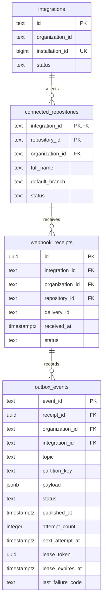

`ConnectorIntegrationRepository` creates organization-owned GitHub installation
metadata, idempotently selects repositories, reads active repositories, and records
disconnect/revocation. An installation can belong to one integration; composite
foreign keys prevent attaching another organization's repository or receipt.
Repository IDs remain strings and names can change independently. Authorization
and GitHub App setup APIs must supply trusted identifiers; this layer stores no
private keys, access tokens, signatures, or raw webhook bodies. Organization IDs
reference the future platform identity boundary rather than a connector-owned user directory.

`ConnectorIntakeStore.accept(PullRequestMergedEvent)` is called after HMAC validation
and normalization. It checks active integration/repository ownership and takes
shared row locks so disconnect/revocation cannot race with acceptance. The database
uniqueness constraint on `(organization_id, integration_id, delivery_id)` absorbs concurrent
redelivery. `ON CONFLICT DO NOTHING` handles both this key and the retained legacy
key so concurrent inserts cannot fail against the other unique index. It returns `true` for a new committed intake and `false` for a duplicate,
preserving the first receipt time and canonical envelope.

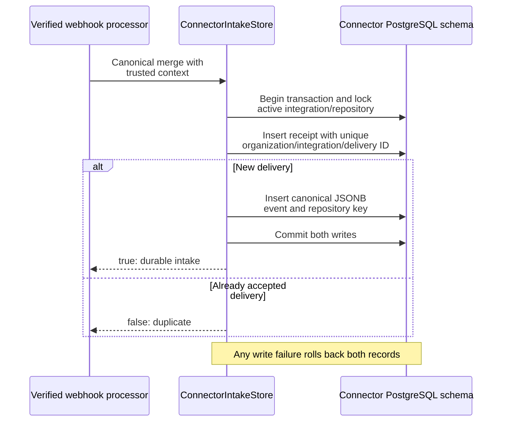

`OutboxEventRepository.findPending(limit)` inspects pending rows across organizations;
it does not claim work. The [relay](#outbox-relay) instead uses `claimNext(leaseDuration)`
and a unique lease token. `markPublished(claim)` and `releaseForRetry(claim, delay, code)`
update only the current owner's row. Pending work and retry timing survive restarts.
At-least-once publication requires downstream consumer deduplication. Already accepted
pending events remain available after an integration is disconnected; disconnect
blocks new intake. Receipts currently record accepted merged PRs; handling ignored
or failed provider deliveries in a separate receipt audit remains future work.

## GitHub event normalization

**Status: implemented for closed, merged pull requests.** Signature verification
is a caller precondition. Unsupported events and unmerged PRs return an empty
result; malformed or incomplete supported payloads fail explicitly. The DTO
retains the actual merge time and full merge commit SHA for later correlation.

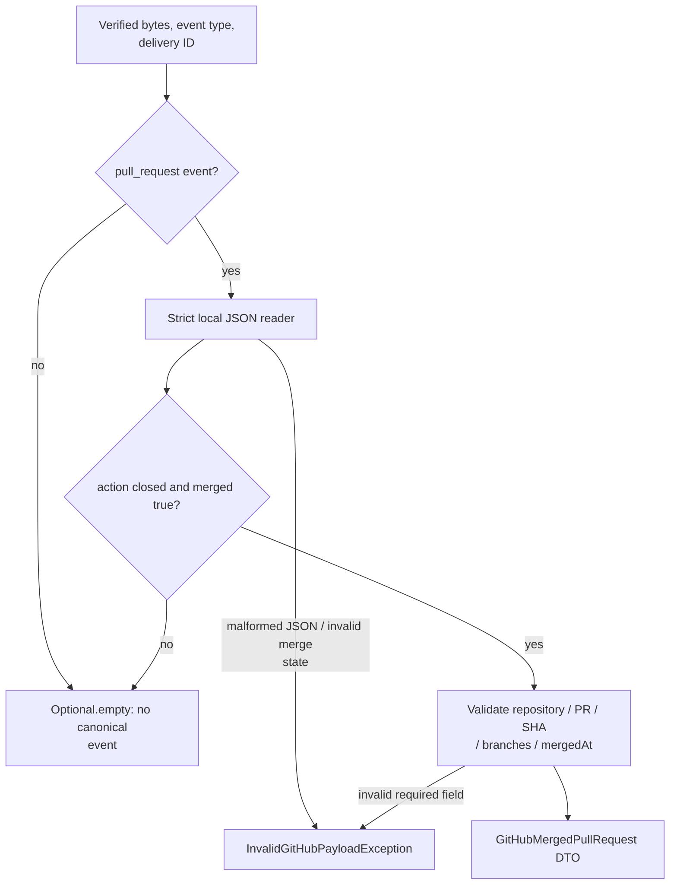

[GitHubEventNormalizer](services/connector-service/src/main/java/com/changeguard/connector/normalization/GitHubEventNormalizer.java)
is a Spring component with this API:

```java
Optional<GitHubMergedPullRequest> normalize(String eventType, String deliveryId, byte[] payload);
```

The caller must verify the signature before invoking the normalizer. It parses
verified request bytes and produces a merged pull request DTO only for
`pull_request` events with `action: closed` and `merged: true`. Other event
types, other actions, and closed but unmerged pull requests return an empty
result. Opened/reopened pull request and push event models remain planned work.

| Output field | Source |
| --- | --- |
| `deliveryId` | The supplied delivery header, retained unchanged. |
| `repositoryId` | Positive `repository.id`, converted to a String without losing integer precision. |
| `repositoryFullName` | `repository.full_name`. |
| `pullRequestNumber` | Positive `pull_request.number`. |
| `pullRequestTitle` | `pull_request.title`; remains null if absent. |
| `commitSha` | `pull_request.merge_commit_sha`, retained in full. |
| `sourceBranch` | `pull_request.head.ref`. |
| `targetBranch` | `pull_request.base.ref`. |
| `actorLogin` | `pull_request.merged_by.login`, then `sender.login` as a fallback; null if neither is available. |
| `mergedAt` | `pull_request.merged_at`, parsed as an `Instant` without substituting receipt time. |

The merge commit field identifies the commit that reached the target branch,
including squash and rebase merges, according to
[GitHub's pull request documentation](https://docs.github.com/en/rest/pulls/pulls#get-a-pull-request).
The normalizer uses that field and does not infer the merge actor from the pull
request author.

Malformed pull request JSON, duplicate fields, trailing JSON, missing merge
state, invalid/missing merge timestamps, and missing required correlation fields raise
`InvalidGitHubPayloadException`. Numeric identities and Boolean merge state are
read without scalar coercion or fractional-number truncation. Unknown GitHub
fields are ignored by the webhook DTO. Reader configuration is local to the
normalizer and preserves the shared application's mapper configuration.

The normalizer retains delivery identity and maps repeated inputs consistently;
durable deduplication is provided by the intake store through the webhook processor.
`normalizeDelivery` additionally requires a positive, strictly typed installation ID
for supported merges. Unsupported activity is ignored only after HMAC verification.
Its sanitized fixture and unit tests are in
[GitHubEventNormalizerTests.java](services/connector-service/src/test/java/com/changeguard/connector/normalization/GitHubEventNormalizerTests.java)
and [pull-request-merged.json](services/connector-service/src/test/resources/github/pull-request-merged.json).

## Canonical merged change event

**Status: implemented.** The factory combines the provider DTO with trusted
organization/integration context and a caller-supplied receipt time. A stable
event ID identifies a scoped delivery across retries. The actor remains `UNKNOWN`
when a login is known and absent when no login is available; no actor type is inferred.

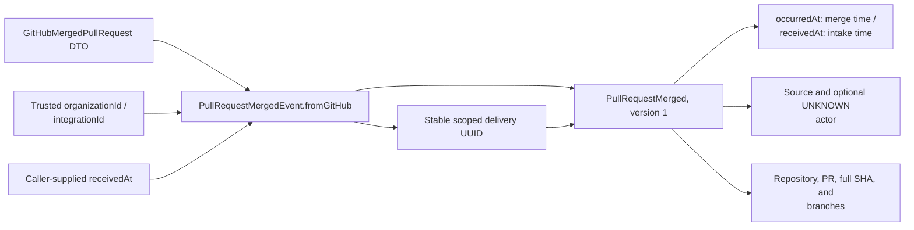

[PullRequestMergedEvent](services/connector-service/src/main/java/com/changeguard/connector/event/PullRequestMergedEvent.java)
is an immutable Java record following the platform's
[event envelope](../README.md#11-canonical-event-model). Construct it from the
normalizer's DTO and trusted integration context:

```java
PullRequestMergedEvent event = PullRequestMergedEvent.fromGitHub(
        mergedPullRequest, organizationId, integrationId, receivedAt);
```

`organizationId` and `integrationId` are internal ChangeGuard identifiers. The
caller supplies the timestamp recorded when the delivery arrived. The factory
uses the DTO's merge timestamp for `occurredAt`, matching the date-time field in
[Octokit's GitHub webhook schema](https://github.com/octokit/webhooks/blob/main/payload-schemas/api.github.com/common/pull-request.schema.json).

| Envelope field | Value |
| --- | --- |
| `eventId` | Deterministic name-based UUID scoped to the organization, integration, and GitHub delivery. |
| `eventType` / `eventVersion` | Fixed `PullRequestMerged` / `1`. |
| `occurredAt` / `receivedAt` | Provider merge time / connector receipt time; UTC microseconds as ISO-8601 in JSONB and Avro `timestamp-micros` on Kafka. |
| `organizationId` | Owning ChangeGuard organization from trusted context. |
| `source` | `provider: github` and the internal integration ID. |
| `actor` | GitHub actor login as `id`, with `type: UNKNOWN`; null if unavailable. |
| `correlation` | Null in the GitHub factory; the record constructor accepts existing `traceId` and `changeId` values. |
| `payload` | Delivery ID, repository ID/full name, pull request number/title, full merge commit SHA, and source/target branches. |

Required identity, timing, source, and merge fields are validated when the record
is constructed. Optional titles and actor data remain absent when unavailable;
the factory does not infer whether an actor is human, a bot, or AI. The event ID
stays the same on redelivery even if `receivedAt` changes. Consumers still need
durable deduplication. Identity components use length prefixes before hashing
so embedded separators do not create ambiguous identities.

## Code event publishing

**Status: implemented and used by the outbox relay.** The
producer sends the event using the repository ID as key. Kafka configuration uses
registered Avro values, `acks=all`, producer idempotence, and no Java type headers. The
returned future represents broker acknowledgement or failure; callers must observe
it. These settings do not provide durable webhook receipt tracking or consumer deduplication.

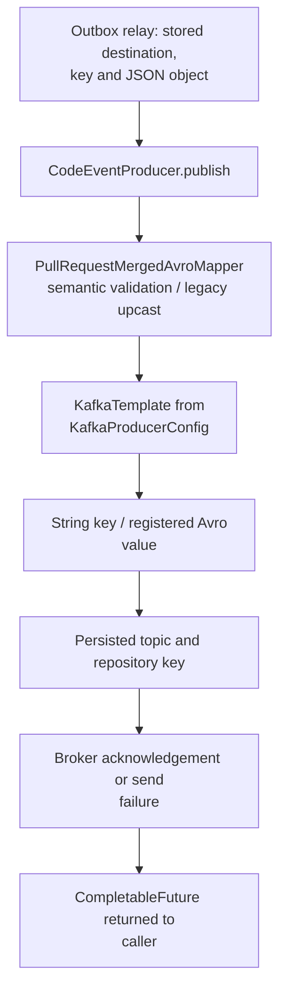

[CodeEventProducer](services/connector-service/src/main/java/com/changeguard/connector/messaging/CodeEventProducer.java)
is a Spring component with this API:

```java
CompletableFuture<SendResult<String, Object>> publish(PullRequestMergedEvent event);
```

It sends the canonical event envelope to the configured `CODE_EVENTS_TOPIC`,
using `event.payload().repositoryId()` as the Kafka key. The mapper creates the
shared `com.changeguard.events.code.PullRequestMerged` record, and the Kafka
serializer resolves its exact registered schema ID. Null events are rejected before sending;
required repository IDs are validated during event construction. A blank topic
fails component initialization.

The returned future completes on Kafka acknowledgement or completes
exceptionally on a later send failure. Errors raised before Kafka returns a
future propagate directly. Callers must observe completion before treating an
event as published. The publisher does not flush each send or add application
retries. Kafka failure logs omit record keys and values.

The relay overload accepts the stored outbox record and parsed JSON, validates
identity metadata, and maps it to the shared Avro record. Latest-contract events
use the recorded topic/key. Historical `CodeChangeMerged` records preserve the
key and event ID while targeting the configured Avro stream. A registry lookup
or serialization failure leaves the event pending for the relay's durable retry.
The [wire format and compatibility policy](docker/schema-registry/README.md#registration-and-compatibility-subsystem)
are shared with future consumers.

## Outbox relay

**Status: implemented scheduled publication with durable retries.**
`OutboxPublishingSchedule` polls independently of HTTP requests.
`OutboxPublisher` handles up to the configured batch size, claiming one fresh lease
per send. PostgreSQL `FOR UPDATE SKIP LOCKED` and atomic claim/update SQL allow
multiple instances to share work. Kafka I/O holds no database transaction open.

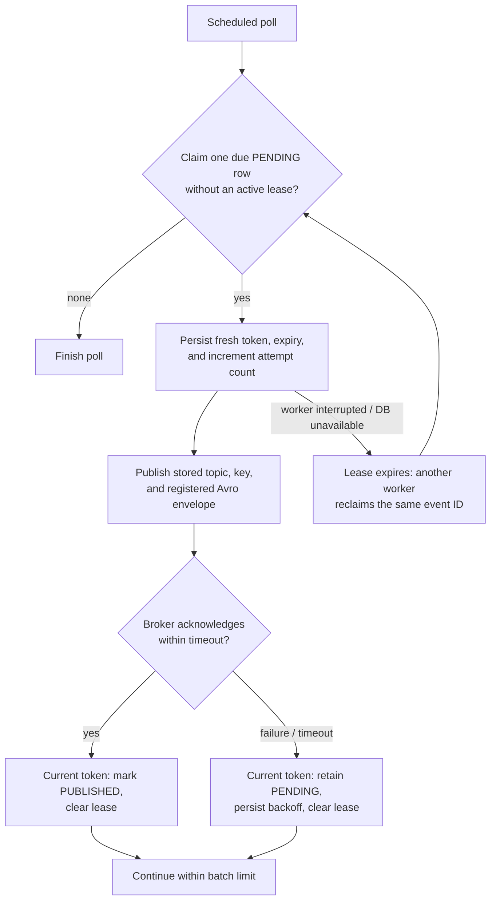

Defaults are one poll per second, 50 events per poll, a 10-second acknowledgement
wait, and a 60-second lease. Failed attempts retry after 1, 2, 4, 8, 16, then 30
seconds, capped at 30 seconds. Attempts continue until publication; no automatic
dead-letter policy is implemented. Failure codes omit exception messages and raw
provider data. Inspect pending age, `attempt_count`, `next_attempt_at`, and
`last_failure_code` to diagnose stalled work.

| Setting | Default | Purpose |
| --- | --- | --- |
| `OUTBOX_ENABLED` | `true` | Enable scheduled polling; `false` keeps HTTP intake durable while pausing publication. |
| `OUTBOX_POLL_INTERVAL` | `1s` | Delay between completed polls. |
| `OUTBOX_BATCH_SIZE` | `50` | Maximum attempted events per poll, from 1 to 1000. |
| `OUTBOX_ACKNOWLEDGEMENT_TIMEOUT` | `10s` | Maximum wait for each send future after Kafka's synchronous send returns. |
| `OUTBOX_LEASE_DURATION` | `60s` | Recovery lease; keep longer than synchronous metadata wait plus acknowledgement timeout and operating margin. |
| `OUTBOX_RETRY_INITIAL_DELAY` | `1s` | First failure's durable backoff. |
| `OUTBOX_RETRY_MAX_DELAY` | `30s` | Backoff cap. |

Producer metadata waits are bounded to 5 seconds and transport delivery retries to
30 seconds. A timed-out send can still reach the broker. A crash after broker
acknowledgement but before the database update can also cause a second publication.
Both retain the same event ID: consumers must deduplicate. Repository keys keep
records in one Kafka partition; concurrent workers and retries do not guarantee
provider occurrence order. A stale worker cannot alter a row after another worker
has replaced its lease token.

## GitHub webhook API

**Status: implemented durable merged-PR intake.** Spring
checks media type, required headers, and body binding; the controller validates
nonblank metadata and signature syntax. It preserves exact bytes and returns 202
only after the processor commits a supported merge or deliberately ignores
verified unsupported activity. Broker availability does not gate HTTP acceptance.

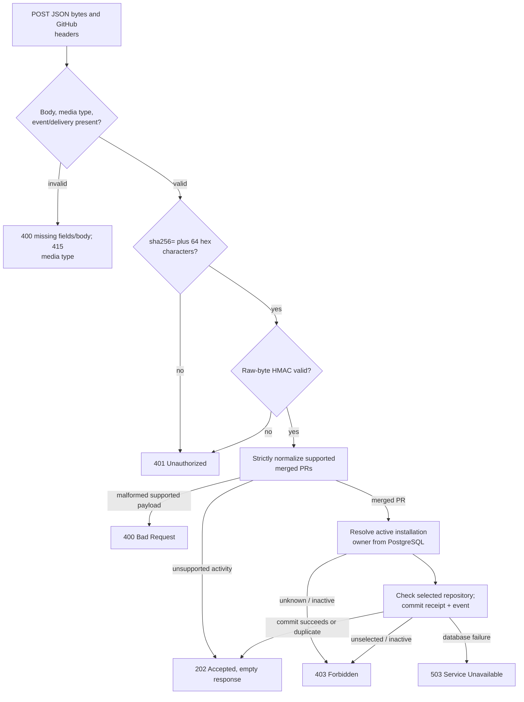

```text
POST /api/v1/integrations/github/webhook
Content-Type: application/json
```

The endpoint accepts the request body as `byte[]` and passes those bytes to the
processing service unchanged. JSON parsing belongs in the processing service,
after signature verification.

| Header | Controller requirement |
| --- | --- |
| `X-GitHub-Event` | Present and nonblank; event routing belongs to the processing service. |
| `X-GitHub-Delivery` | Present and nonblank; retained for durable integration/delivery deduplication. |
| `X-Hub-Signature-256` | `sha256=` followed by exactly 64 hexadecimal characters. |

The controller checks signature syntax. The processor verifies cryptographic HMAC
before parsing or looking up installation ownership. GitHub's organization ID and
repository name do not establish internal organization ownership.

### Signature verification

**Status: implemented and called before payload parsing.** Validation hashes
the exact body with the configured server-side secret and compares decoded digests
using `MessageDigest.isEqual`. Malformed signatures fail validation, and an empty
secret fails initialization. Header syntax alone does not authenticate a delivery.

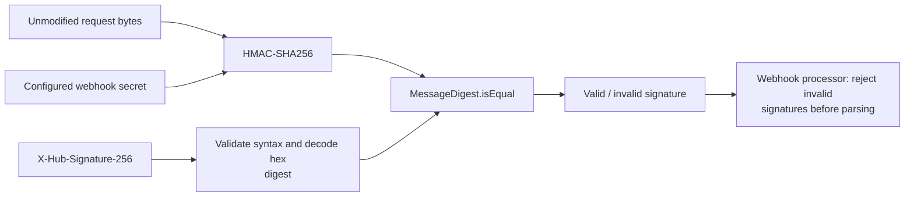

`GitHubSignatureValidator.isValid(byte[] payload, String signatureHeader)` hashes
the unmodified body directly and compares the decoded SHA-256 digests with
`MessageDigest.isEqual`. It rejects malformed signature headers and fails
initialization when the configured secret is blank. Invoke it before decoding
or parsing the request body, following
[GitHub's signature validation guidance](https://docs.github.com/en/webhooks/using-webhooks/validating-webhook-deliveries).

| Status | Meaning |
| --- | --- |
| `202 Accepted` | A supported merge committed durably, was already accepted, or verified unsupported activity was ignored; empty body. |
| `400 Bad Request` | Missing metadata/body, invalid pull request JSON, or missing/invalid required merge or installation fields. |
| `401 Unauthorized` | Missing/malformed signature or HMAC mismatch. |
| `403 Forbidden` | A merged delivery's installation or selected repository is unknown, disconnected, or revoked. |
| `415 Unsupported Media Type` | The request content type is unsupported. |
| `503 Service Unavailable` | Durable database lookup/write/commit failed; the delivery was not acknowledged and can be retried. |

Service rejections expressed as `ResponseStatusException` retain their HTTP
status. The controller acknowledges only a normal return from the service.

To exercise rejection locally with a synthetic signature:

```sh
curl -i http://localhost:8081/api/v1/integrations/github/webhook \
  -H 'Content-Type: application/json' \
  -H 'X-GitHub-Event: push' \
  -H 'X-GitHub-Delivery: 72d3162e-cc78-11e3-81ab-4c9367dc0958' \
  -H 'X-Hub-Signature-256: sha256=aaaaaaaaaaaaaaaaaaaaaaaaaaaaaaaaaaaaaaaaaaaaaaaaaaaaaaaaaaaaaaaa' \
  --data-binary '{}'
```

Expect `401`: the signature was not computed from the configured webhook secret.
To exercise acceptance, send a properly signed merge fixture after creating its
installation/repository binding. The automated HTTP and Kafka integration tests
perform this complete flow against isolated infrastructure.

## Security and observability

**Status: implemented development access rules and health/info; platform identity
and metrics infrastructure are planned.** Only the webhook POST bypasses CSRF;
other writes retain it. Public health checks support container startup. Other
routes require stateless HTTP Basic. The configured Prometheus endpoint has no
registry dependency and is currently unavailable.

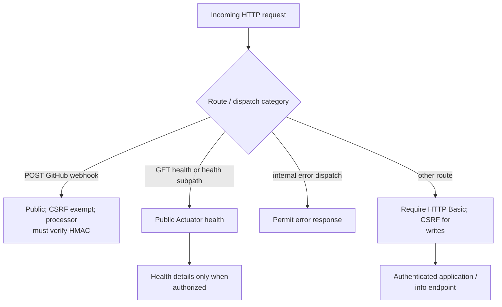

[SecurityConfig](services/connector-service/src/main/java/com/changeguard/connector/config/SecurityConfig.java)
applies these access rules:

- The webhook POST is public and exempt from CSRF checks. Its processing service
  must authenticate deliveries through signature verification.
- GET requests to `/actuator/health` and `/actuator/health/**` are public.
  Health groups such as readiness and liveness depend on Actuator configuration.
- Other routes require HTTP Basic authentication. Writes outside the webhook
  keep CSRF protection. Form login, logout, and the request cache are disabled;
  authentication does not create a session.
- Internal error dispatches are permitted so application errors keep their
  intended HTTP status.

The development username defaults to `user`; Spring Boot prints a generated
password at startup when no password is configured. For example, this command
prompts for that password and requests the authenticated info endpoint:

```sh
curl --user user http://localhost:8081/actuator/info
```

OAuth2/JWT authentication is planned. Actuator exposes health and info with the
current dependencies. Prometheus exposure/export is configured in YAML, but the
Prometheus registry dependency is absent, so `/actuator/prometheus` is currently
unavailable. Health details use `show-details: when_authorized`.

Web logging defaults to INFO to suppress Spring's DEBUG request-body output.
Connector package logging is DEBUG; the controller does not log payloads or
signatures.

## Source map and remaining work

**Status: implemented merged-PR pipeline; broader V1 integration is partial.**
The processor authenticates bytes before trusting identifiers, resolves stored
installation ownership, and commits supported deliveries before returning.
Receipts and canonical outbox events commit together; an independent scheduled
relay publishes and observes broker acknowledgement. Redelivery and publication
retries retain stable identities.
This completes intake independently of the downstream timeline projection.

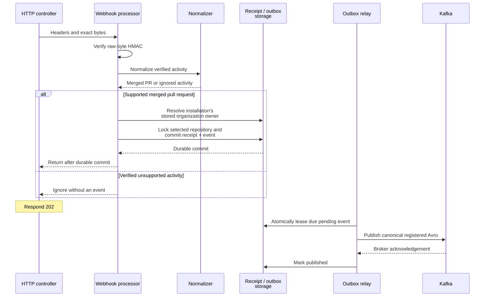

Paths below are relative to
`services/connector-service/src/main/java/com/changeguard/connector/`:

| File | Current responsibility or status |
| --- | --- |
| [ConnectorServiceApplication.java](services/connector-service/src/main/java/com/changeguard/connector/ConnectorServiceApplication.java) | Spring Boot entry point and component scanning. |
| [config/KafkaProducerConfig.java](services/connector-service/src/main/java/com/changeguard/connector/config/KafkaProducerConfig.java) | `ProducerFactory<String, Object>` and `KafkaTemplate<String, Object>` beans using configured Kafka properties. |
| [config/SecurityConfig.java](services/connector-service/src/main/java/com/changeguard/connector/config/SecurityConfig.java) | Stateless HTTP security and route access rules. |
| [api/GitHubWebhookController.java](services/connector-service/src/main/java/com/changeguard/connector/api/GitHubWebhookController.java) | HTTP/header validation, raw-byte handoff, and acknowledgement after service return. |
| [github/PersistentGitHubWebhookService.java](services/connector-service/src/main/java/com/changeguard/connector/github/PersistentGitHubWebhookService.java) | Implements `GitHubWebhookService`: verifies HMAC, normalizes supported merges, resolves stored ownership, and commits intake. |
| [github/GitHubSignatureValidator.java](services/connector-service/src/main/java/com/changeguard/connector/github/GitHubSignatureValidator.java) | HMAC-SHA256 verification of unmodified request bytes before parsing. |
| [normalization/GitHubEventNormalizer.java](services/connector-service/src/main/java/com/changeguard/connector/normalization/GitHubEventNormalizer.java) | Maps verified closed-and-merged pull request payloads into a provider DTO with merge time; rejects malformed payloads and skips unsupported activity. |
| [event/PullRequestMergedEvent.java](services/connector-service/src/main/java/com/changeguard/connector/event/PullRequestMergedEvent.java) | Validated version-one event envelope with stable delivery identity, trusted organization/integration context, and merge details. |
| [messaging/PullRequestMergedAvroMapper.java](services/connector-service/src/main/java/com/changeguard/connector/messaging/PullRequestMergedAvroMapper.java) | Validates and maps durable JSON to shared Avro; upcasts historical merged-PR records. |
| [config/SchemaRegistryConfiguration.java](services/connector-service/src/main/java/com/changeguard/connector/config/SchemaRegistryConfiguration.java) | Registers reviewed code schemas and subject policy before creating the producer. |
| [messaging/CodeEventProducer.java](services/connector-service/src/main/java/com/changeguard/connector/messaging/CodeEventProducer.java) | Publishes canonical merged change events using repository keys and returns acknowledgement futures. |
| [persistence/ConnectorIntegrationRepository.java](services/connector-service/src/main/java/com/changeguard/connector/persistence/ConnectorIntegrationRepository.java) | Organization-scoped GitHub installation/repository metadata and disconnect/revocation state. |
| [persistence/ConnectorIntakeStore.java](services/connector-service/src/main/java/com/changeguard/connector/persistence/ConnectorIntakeStore.java) | Atomic accepted receipt/outbox persistence and concurrent delivery deduplication. |
| [persistence/OutboxEventRepository.java](services/connector-service/src/main/java/com/changeguard/connector/persistence/OutboxEventRepository.java) | Atomic leased claims, token-fenced publication updates, and durable retry state. |
| [messaging/OutboxPublisher.java](services/connector-service/src/main/java/com/changeguard/connector/messaging/OutboxPublisher.java) | Publishes stored envelopes and observes acknowledgement before recording success. |
| [messaging/OutboxPublishingSchedule.java](services/connector-service/src/main/java/com/changeguard/connector/messaging/OutboxPublishingSchedule.java) | Polls due events independently of HTTP and recovers after failed polls. |
| [config/OutboxProperties.java](services/connector-service/src/main/java/com/changeguard/connector/config/OutboxProperties.java) | Validates worker limits and computes capped exponential retry delay. |

The processing contract is:

```java
void handleWebhook(String eventType, String deliveryId, String signature, byte[] payload);
```

The implementation verifies SHA-256 HMAC before parsing or trusting identifiers,
handles supported and unsupported events explicitly, and durably receives supported
deliveries before returning. Verified unsupported events are ignored. Rejections
and persistence failures propagate as documented HTTP statuses.

Next work includes GitHub App setup and authorized integration APIs, opened-PR
and commit webhook adapters, and downstream consumers. The
[GitHub integration delivery plan](../docs/plans/github-repository-integration.md)
covers installation, persistence, transactional outbox, canonical schemas, and
the first complete ingestion-to-timeline flow. The
[platform README](../README.md) describes the broader backend architecture and
planned services.
