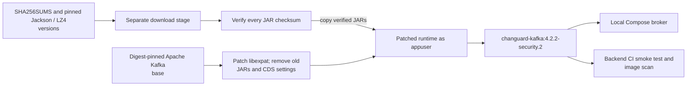
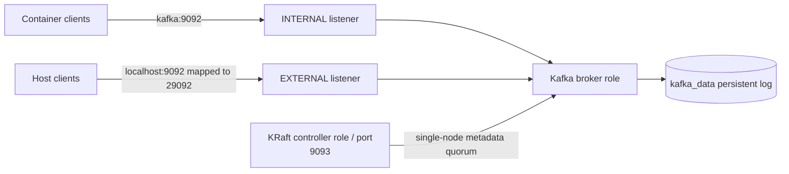
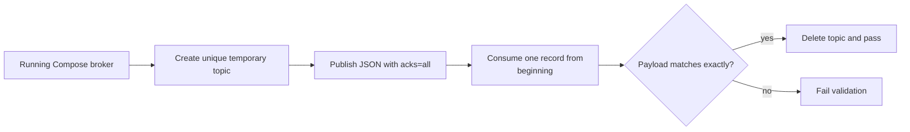

# Patched Kafka image

Compose and backend CI build `changuard-kafka:4.2.2-security.2` from this directory.
The base is Apache Kafka 4.2.2, pinned to its multi-platform image digest. The
broker version, startup configuration, and data-volume format stay at 4.2.2.

## Image build subsystem

**Status: implemented.** The build fetches the pinned Jackson modules and LZ4 in a
separate stage and verifies each artifact against `SHA256SUMS`. The runtime stage
patches libexpat, removes replaced JARs and incompatible class-data archives,
copies verified JARs, and returns to `appuser`. This produces the Kafka image
used by both Compose and backend CI.



## Broker and validation subsystems

**Status: implemented single-node development broker.** The Compose node combines
KRaft controller and broker roles. Containers use the internal `kafka:9092`
listener; host clients use `localhost:9092` by default through container port
29092. The controller listener on 9093 coordinates the node, and `kafka_data`
retains the log. Listener transport is plaintext in this local stack.



The smoke test checks a real acknowledged produce/consume round trip, beyond
broker health. It creates a unique temporary topic, sends one JSON record, reads
the first record, verifies exact payload equality, and deletes the topic on
success. Backend CI also scans the resulting runtime image.



## Dependency patches and operation

The upstream image had five HIGH findings on October 4, 2026. The October 9
database also flags its LZ4 dependency for `CVE-2026-106451`. This image applies
the following stable dependency patches:

| Dependency | Upstream version | Patched version | Findings addressed |
| --- | --- | --- | --- |
| libexpat | `2.8.4-r0` | `2.8.5-r0` | `CVE-2026-93990` |
| Jackson core | `2.21.6` | `2.21.7` | `CVE-2026-89407`, `CVE-2026-89425` |
| Jackson databind | `2.21.6` | `2.21.7` | `CVE-2026-91776`, `CVE-2026-91777` |
| LZ4 Java | `1.11.1` | `1.11.4` | `CVE-2026-106451` |

Nine Jackson modules in the Kafka distribution are updated to 2.21.7;
annotations remain at 2.21, matching the
[Jackson BOM](https://github.com/FasterXML/jackson-bom/blob/jackson-bom-2.21.7/pom.xml).
The [SHA256SUMS](SHA256SUMS) file pins the artifact checksums published by Maven
Central. Downloads are verified in a separate build stage before the JARs enter
the runtime image. Old JARs are removed, and the image still runs as `appuser`.

LZ4 1.11.4 fixes native-library extraction through predictable temporary files;
see the [maintainer's advisory](https://github.com/yawkat/lz4-java/security/advisories/GHSA-mcr4-qmvw-px4g).
The backend parent also manages this version for the connector and Registry.
Their real Kafka wire test enables LZ4 compression to check interoperability
through the patched broker and client libraries.

Apache's prebuilt JVM class-data archives were generated with the old JARs.
The Dockerfile removes those archives and their startup options so both storage
formatting and broker startup use the patched libraries. This gives up that
startup optimization; it does not change the Kafka data format.

From the repository root, build and test with:

```sh
docker compose up --build --wait connector-service
sh backend/docker/kafka/smoke-test.sh
```

The smoke test creates a temporary topic, publishes a JSON message with broker
acknowledgement, verifies the consumed payload, and deletes the topic. It accepts
Docker Compose options, for example `--project-name validation --env-file /tmp/validation.env`,
to test an isolated stack.

Backend CI builds this image, runs the message test, and scans the resulting
image with Trivy 0.70.0. The scan includes unfixed vulnerabilities and fails CI
on HIGH/CRITICAL findings. Local validation on October 4, 2026
found zero HIGH/CRITICAL vulnerabilities or secret findings in the patched image.

When updating the patches, keep Jackson modules aligned with their BOM, update
the artifact checksums from Maven Central, and rerun the build, message test,
and image scan. A newer upstream stable image can replace this customization
once it contains the fixes and passes these same checks.
