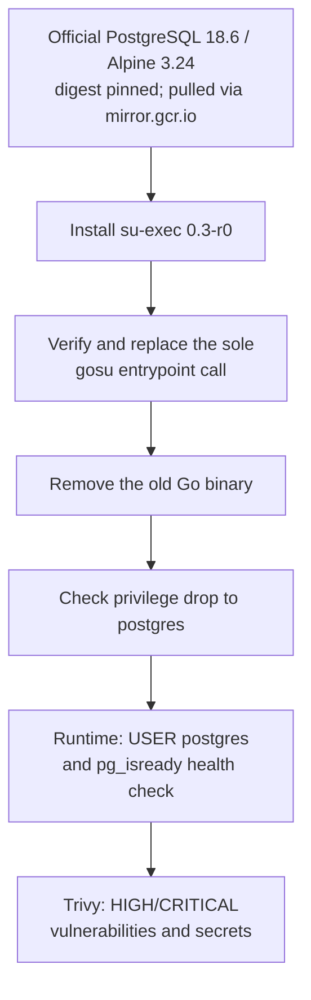
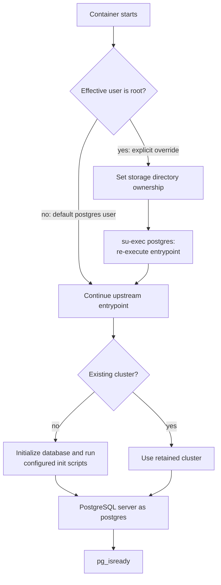
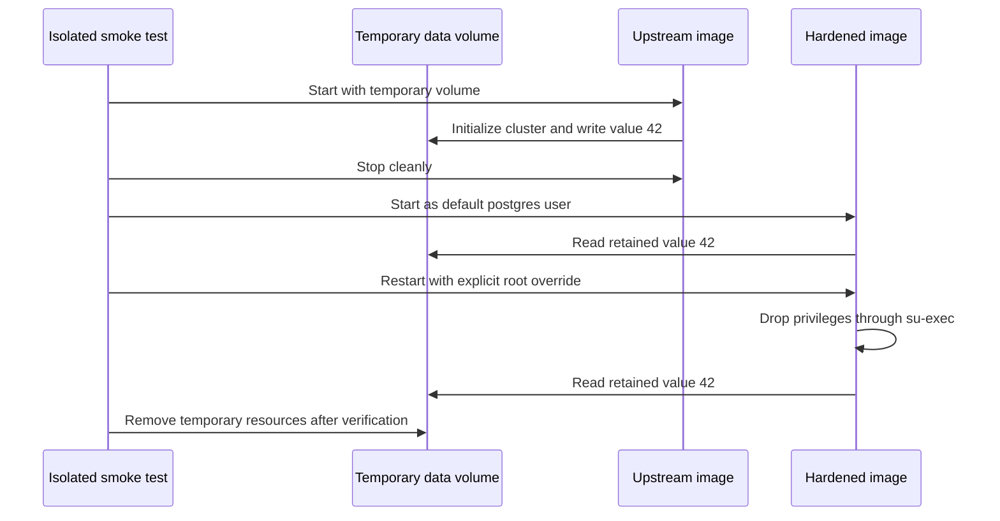

# ChangeGuard PostgreSQL image

**Status: implemented.** Compose and backend CI build
`changuard-postgres:18.6-security.1` from the official PostgreSQL 18.6 Alpine 3.24
image pinned to its multi-platform digest. The server version, PostgreSQL 18 data
layout, and SQL storage format are retained. Connector-owned tables and migrations
are described in [connector persistence](../../README.md#connector-persistence).

The Dockerfile and compatibility smoke test pull the upstream image through
`mirror.gcr.io` using the same PostgreSQL digest. The Dockerfile frontend is also
mirrored and digest-pinned. This avoids Docker Hub's anonymous pull limit during
both image builds and verification; see the [shared CI setup](../../../README.md#25-cicd).

## Image build subsystem

The upstream image bundles `gosu` 1.19 compiled with Go 1.24.6. On October 7, 2026,
Trivy reported 22 HIGH/CRITICAL findings in that binary's Go standard library.
The [Dockerfile](Dockerfile) installs the version-pinned Alpine `su-exec=0.3-r0`
package, substitutes the entrypoint's single privilege-drop call, and removes the
old binary. Build assertions fail if the expected entrypoint changes or the helper
cannot switch to the PostgreSQL operating-system user. The final image defaults to
`USER postgres` and provides a readiness health check.



`su-exec` switches user/group identities and directly executes the command,
preserving process and signal behavior. See the
[upstream helper documentation](https://github.com/ncopa/su-exec) and
[official PostgreSQL image source](https://github.com/docker-library/postgres/blob/master/18/alpine3.24/Dockerfile).

## Database startup subsystem

PostgreSQL 18 stores its cluster under `/var/lib/postgresql/18/docker`. Compose
mounts `postgres_data` at `/var/lib/postgresql`, and the image's writable parent
allows initialization by the `postgres` user. Existing clusters initialized by
the pinned upstream image remain readable. An explicit root startup still follows
the upstream directory-ownership setup and then executes the patched privilege
helper before starting the server.



Build and start from the repository root:

```sh
docker compose build postgres
docker compose up -d --wait postgres
```

`POSTGRES_IMAGE` can override the local image. Existing database settings and the
named volume remain the same. Stop with `docker compose down` to retain data.

## Verification subsystem

The [smoke test](smoke-test.sh) creates its own container and volume, initializes
data with the pinned upstream image, and checks that the hardened image reads it
through both default and explicit-root startup. It verifies that the server runs
as `postgres` and removes only its temporary resources. CI also runs the connector's
real PostgreSQL tests against the hardened image, covering migrations, ownership,
transactional intake, leases, and publication recovery.



Run from the repository root:

```sh
sh backend/docker/postgres/smoke-test.sh
cd backend/services/connector-service
./mvnw -Dchangeguard.test.postgres-image=changuard-postgres:18.6-security.1 verify
```

Without that test property, Testcontainers uses the pinned upstream PostgreSQL
image for isolated schema tests. CI builds the hardened image first and sets the
property so runtime startup behavior is covered too. Image scans retain the
existing HIGH/CRITICAL failure gate and do not use vulnerability exclusions.
