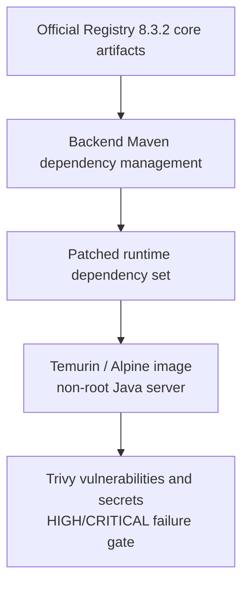
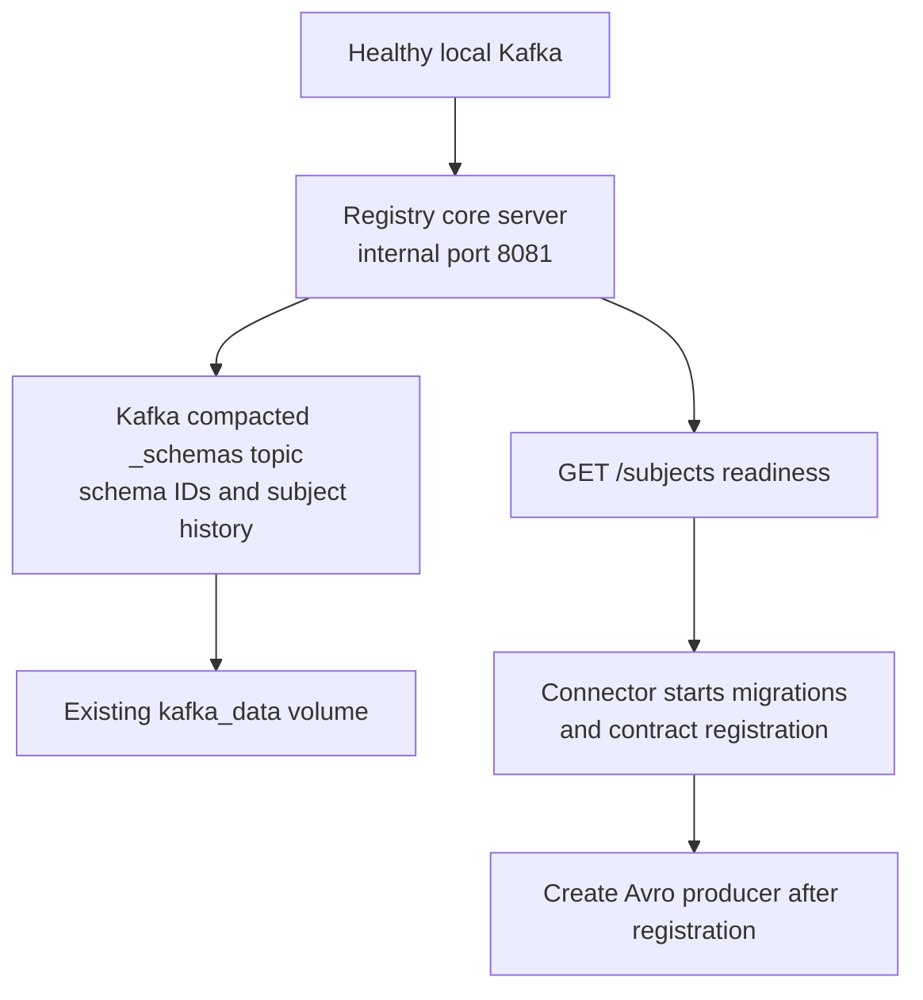
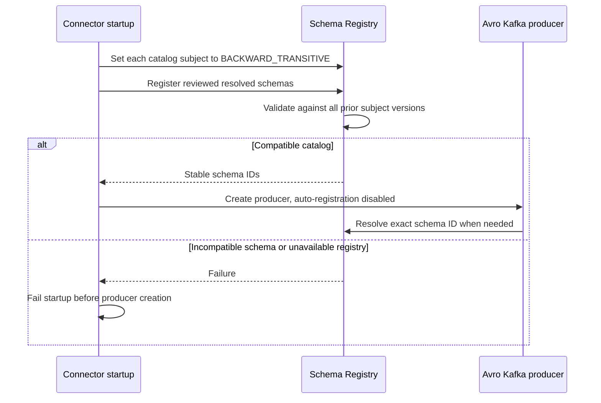
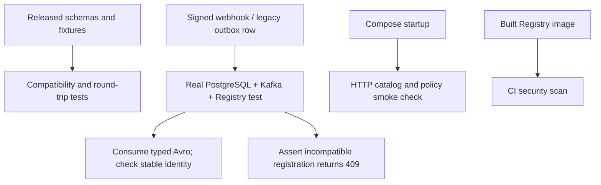

# ChangeGuard Schema Registry

**Status: implemented.** Compose and backend integration tests use
`changuard-schema-registry:8.3.2-security.2`, which runs the Confluent Schema Registry
8.3.2 core server with the backend's patched dependencies. The connector registers
the [shared V1 code-event catalog](../../event-contracts/README.md) before creating
its Kafka producer.

## Runtime build subsystem

The [runtime Maven module](pom.xml) resolves the official core server artifacts
through the backend parent. The [Dockerfile](Dockerfile) packages that dependency
set on Temurin 21.0.12.1+1 / Alpine 3.24 and runs as UID 10001. The shared parent
pins Jackson 2.21.7, Jackson 3.1.7, Avro 1.12.2, and HTTP Core 5.4.3. SLF4J 2 uses
the matching Log4j binding so startup and request failures appear in container logs.
The server module explicitly uses Confluent's `kafka-clients 8.3.2-ccs`, matching
the server's leader-election API; the connector uses Spring Boot's managed client.
Registry's core and EE10 Jetty modules use the consistent 12.0.37 server line.
The shared parent pins LZ4 Java 1.11.4 for `CVE-2026-106451`; the `security.2`
runtime replaces the earlier image's vulnerable 1.11.1 dependency.



On October 7, 2026, the upstream full distribution image had 50 HIGH/CRITICAL
findings. The core runtime uses the platform's base image and patched Maven
dependencies; scans cover the final runtime image in CI. See the
[official Registry documentation](https://docs.confluent.io/platform/current/schema-registry/index.html)
for its protocol and operating model.

## Startup and durable storage subsystem

The [entrypoint](entrypoint.sh) requires
`SCHEMA_REGISTRY_KAFKASTORE_BOOTSTRAP_SERVERS`, writes runtime configuration to
`/tmp`, and executes the Registry main class. Compose waits for Kafka health,
then probes Registry `/subjects` before starting the connector. The runtime has
a read-only filesystem and a writable temporary directory.



Schema history persists in Kafka's `_schemas` topic and survives Registry
container replacement. The local replication factor is one, matching the
single-broker development stack. Production broker replication, authentication,
and Registry access controls remain deployment configuration.

| Setting | Local value |
| --- | --- |
| `SCHEMA_REGISTRY_IMAGE` | `changuard-schema-registry:8.3.2-security.2` |
| `SCHEMA_REGISTRY_PORT` | `8082` on localhost; Registry container listens on `8081`. |
| `SCHEMA_REGISTRY_URL` | `http://localhost:8082` for Maven clients; Compose supplies `http://schema-registry:8081`. |
| `SCHEMA_REGISTRY_KAFKASTORE_BOOTSTRAP_SERVERS` | `PLAINTEXT://kafka:9092` in Compose. |
| `SCHEMA_REGISTRY_KAFKASTORE_TOPIC_REPLICATION_FACTOR` | `1` for local development. |

## Registration and compatibility subsystem

The server default and each code-event subject use `BACKWARD_TRANSITIVE`.
Connector startup idempotently registers the reviewed schemas under
`<topic>-<fully-qualified-record-name>`. An unavailable Registry or incompatible
schema prevents producer creation and successful startup. The Kafka serializer
has `auto.register.schemas=false`, `use.latest.version=false`, and
`normalize.schemas=true`, so publication resolves the exact reviewed writer schema.



Kafka values use the Confluent wire format: magic byte `0`, a four-byte schema ID,
then binary Avro. Keys remain plain strings. Consumers resolve the writer schema
by ID and apply their compatible reader schema. Cached schema IDs can allow a
running producer to continue during a Registry outage; an uncached lookup failure
leaves the outbox row pending for durable retry.

## Verification subsystem

The real Kafka/PostgreSQL/Registry integration test consumes a signed webhook as a
generated Avro record using LZ4-compressed Kafka batches, checks redelivery, verifies legacy-row cutover without
rewriting storage, and confirms Registry rejection of incompatible evolution.
Shared tests check released schema compatibility, semantic validation, nullable
fields, Unicode, large repository IDs, and binary round trips.



From the repository root:

```sh
docker compose up --build --wait connector-service
python3 backend/docker/schema-registry/verify-contracts.py
```

[verify-contracts.py](verify-contracts.py) checks all three record names, schema
IDs, and per-subject policies through the live Registry API. It accepts `--url`
and `--topic` overrides. To run the Java integration tests independently, first
build `postgres`, `kafka`, and `schema-registry` through Compose, then run the
[backend verification commands](../../README.md#build-and-test). CI builds these
same images and keeps security report artifacts and readable job summaries.
