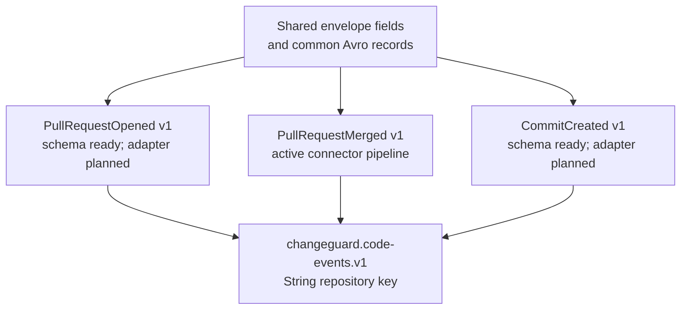
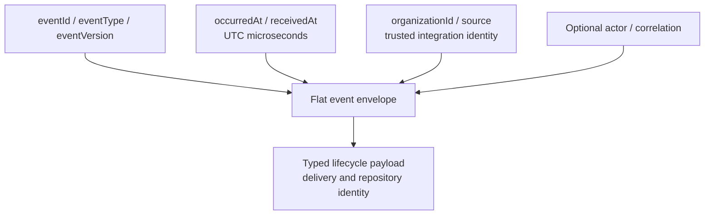
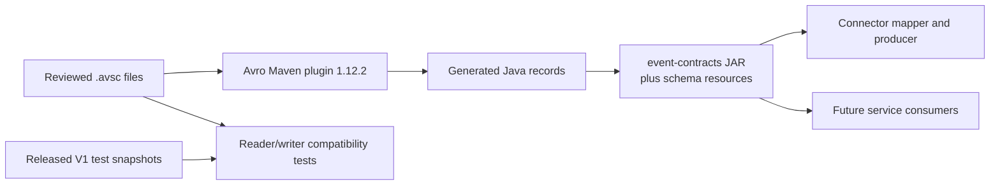
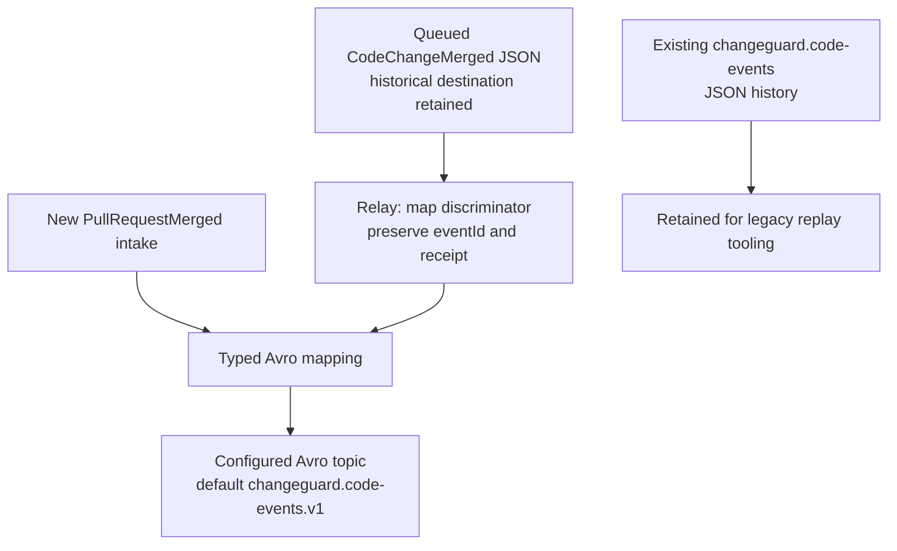

# Shared V1 event contracts

**Status: implemented schemas, generated Java records, compatibility checks, and
merged-PR publication.** `PullRequestMerged` is the canonical name. The former
`CodeChangeMerged` discriminator is accepted only when reading historical connector
outbox rows. The connector currently ingests merged pull requests; the adapters for
opened pull requests and commits remain planned.

## Schema catalog subsystem

The [version-one schemas](src/main/avro/v1) define three provider-neutral records in
`com.changeguard.events.code`. Each record uses the same flat envelope and a typed
payload. Common source, actor, and correlation records live under
`com.changeguard.events.common`. Avro has no record inheritance, so the envelope
fields are repeated in the three schemas and checked for consistency by tests.



| Record | Payload beyond delivery/repository identity |
| --- | --- |
| [PullRequestMerged](src/main/avro/v1/PullRequestMerged.avsc) | PR number, optional title, full merge commit SHA, source branch, target branch. |
| [PullRequestOpened](src/main/avro/v1/PullRequestOpened.avsc) | PR number, optional title, full head commit SHA, source branch, target branch. |
| [CommitCreated](src/main/avro/v1/CommitCreated.avsc) | Full commit SHA, optional commit message, optional branch. One event represents one commit; a delivery containing multiple commits must derive distinct IDs from delivery and commit identity. |

All payloads retain `deliveryId`, `repositoryId`, and `repositoryFullName`.
Repository IDs are strings to preserve provider identities beyond JavaScript's
safe integer range. The actor may be null; `UNKNOWN` preserves a known actor ID
without guessing its classification. Titles, messages, and correlation identifiers
may be absent; raw provider payloads and credentials do not belong in these schemas.

## Common envelope subsystem

The envelope contains `eventId`, `eventType`, `eventVersion`, `occurredAt`,
`receivedAt`, `organizationId`, `source`, optional `actor`, optional `correlation`,
and the event-specific `payload`. Occurrence and receipt timestamps use Avro
`timestamp-micros` and map to Java `Instant`. Connector JSON uses ISO-8601 with the
same UTC microsecond precision. `receivedAt` records first acceptance and does not
replace the provider's occurrence time.



[CodeEventSchemas.validate](src/main/java/com/changeguard/events/CodeEventSchemas.java)
checks semantic requirements that Avro's type system cannot express: the
discriminator must match the record, V1 must have `eventVersion=1`, trusted
identity fields must be nonblank, and PR numbers must be positive. The connector
validates this before sending. Consumers should validate after deserialization and
deduplicate by `eventId` before applying domain updates.

The repository ID remains the Kafka partition key. It groups records for the same
repository; outbox concurrency and retries do not imply provider occurrence order.

## Generation and evolution subsystem

The [backend Maven reactor](../pom.xml) generates Java records with Avro 1.12.2,
packages the schemas as resources under `avro/v1`, and supplies the JAR to the
connector. Generated sources remain in `target/generated-sources/avro`.



From the repository root:

```sh
sh backend/services/connector-service/mvnw -f backend/pom.xml -pl event-contracts -am verify
```

The [released V1 test snapshots](src/test/resources/released/v1) establish the
baseline for compatibility tests. Preserve released snapshots when evolving
schemas, and add a snapshot for each released revision. Registry registration
also checks every prior subject version under `BACKWARD_TRANSITIVE`. New optional
fields need defaults so new readers can decode earlier records. Semantic breaking
changes require a separately reviewed major contract and stream.

`eventVersion` is the semantic contract version. Registry subject versions count
registered schema revisions, and a schema ID identifies a writer schema; these
are separate values. Subjects follow `TopicRecordNameStrategy`, for example
`changeguard.code-events.v1-com.changeguard.events.code.PullRequestMerged`, so
each lifecycle type evolves independently within one topic.

Avro 1.12.2 requires explicit permission to load generated Java records.
Call `CodeEventSchemas.trustGeneratedClasses()` before configuring a specific
consumer. The helper allows only this module's generated classes and preserves
Avro's existing trust rules. Java consumers also need the managed Confluent
`kafka-avro-serializer` dependency, `KafkaAvroDeserializer`, the Registry URL,
and `specific.avro.reader=true`. Registry registration uses each generated
record's fully resolved schema, including its common definitions.

## Legacy event cutover subsystem

New intakes store `PullRequestMerged` V1. The relay maps queued `CodeChangeMerged`
V1 envelopes to the canonical Avro record and sends them to the configured Avro
topic. Their stored payload, original topic metadata, event ID, organization,
integration, and delivery identity remain intact. New rows use their recorded
topic as before.



The stable merged-PR UUID keeps the original `CodeChangeMerged:github:` identity
namespace, with length-prefixed organization, integration, and delivery parts.
Renaming the event therefore does not change a delivery's identity.

For an existing deployment, stop the older JSON-producing connector, set
`CODE_EVENTS_TOPIC=changeguard.code-events.v1`, then start the new Compose stack.
Use an Avro-aware consumer on that stream. Existing JSON messages stay on the
earlier topic, and accepted pending receipts are recovered by the new relay.
Schema-only readiness for `PullRequestOpened` and `CommitCreated` does not add
their webhook handlers or a downstream timeline service.
