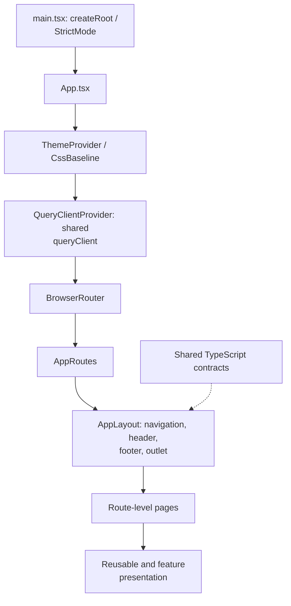
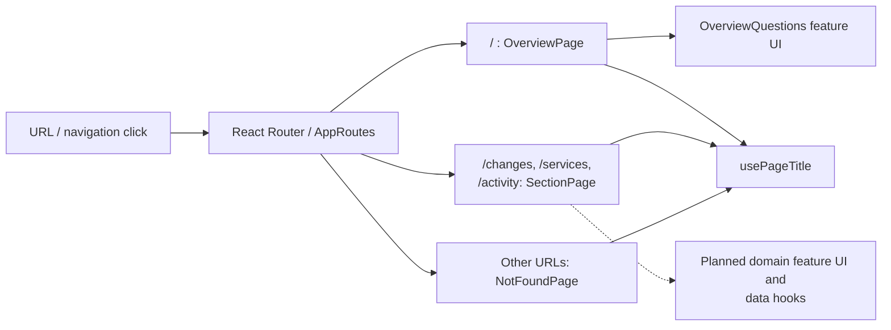
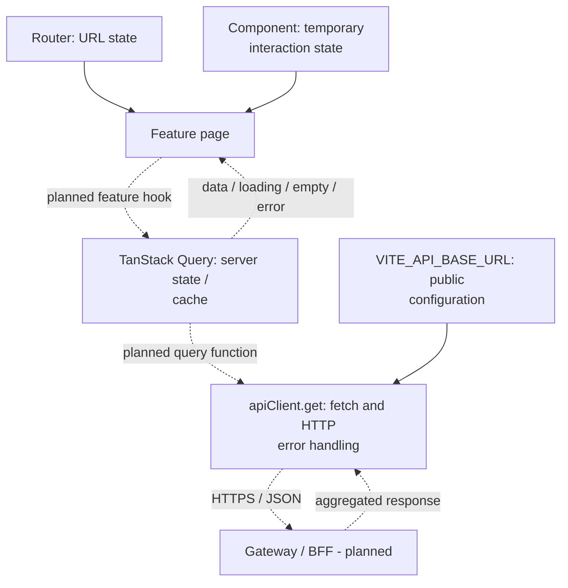
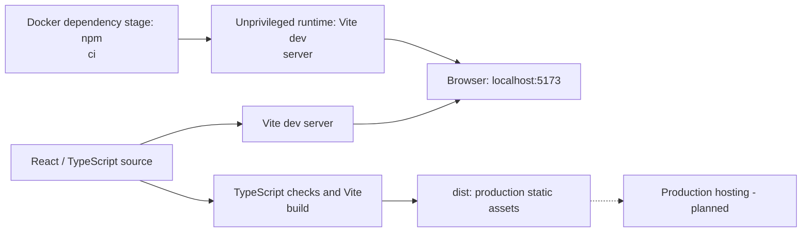

# ChangeGuard frontend

The frontend is a React and TypeScript single-page application built with Vite and Material UI.
It sits behind the API Gateway / BFF and consumes aggregated read APIs; it does not access
Kafka or backend services directly.

## System and subsystems

**Status: partial.** App composition, theme, navigation, placeholder pages, query
defaults, and the GET transport are implemented. Feature queries, real delivery
data, authentication UI, and the Gateway/BFF are planned. Dashed arrows below
identify connections that still need implementation.

| Subsystem | Responsibility | Status |
| --- | --- | --- |
| [App composition and presentation](#app-composition-and-presentation) | Bootstrap React and supply the theme, query client, router, and reusable shell. | Implemented |
| [Navigation and feature pages](#navigation-and-feature-pages) | Map URLs to route pages and domain UI; keep title and navigation consistent. | Shell implemented; data views planned |
| [State and API transport](#state-and-api-transport) | Separate URL, server, and transient interaction state; fetch through one API boundary. | Defaults/GET helper implemented; feature hooks planned |
| [Build and runtime](#build-and-runtime) | Serve local development and build deployable static assets. | Implemented; production hosting planned |

### App composition and presentation

[main.tsx](src/main.tsx) mounts the app under React StrictMode.
[App.tsx](src/app/App.tsx) supplies MUI's theme and CSS baseline, one shared
TanStack Query client, and BrowserRouter. [AppLayout](src/components/layout/AppLayout.tsx)
owns persistent navigation, header, footer, and the route outlet. Shared
components render presentation; `src/types/` supplies contracts such as navigation
items. This composition is implemented and currently makes no platform API calls.



### Navigation and feature pages

[AppRoutes.tsx](src/app/AppRoutes.tsx) selects a page inside the shared layout.
Overview composes `features/overview/OverviewQuestions`; Changes, Services, and
Activity reuse `SectionPage` placeholders. Each page calls `usePageTitle` to update
the document title. Future feature modules will own domain UI and query hooks,
while pages retain route-level composition and shared hooks retain reusable behavior.



### State and API transport

React Router owns navigation state; TanStack Query will own fetched server state;
components own transient UI state. The implemented query defaults set a 30-second
stale time, one retry, and no refetch on window focus.
[apiClient.get](src/services/apiClient.ts) builds URLs from `VITE_API_BASE_URL`
(default `/api`), supports an abort signal, returns typed JSON, and throws on
non-success HTTP responses. Response typing is a TypeScript contract, not runtime
schema validation. Feature hooks and explicit loading, empty, and error states are
planned; current pages do not invoke the API helper.



### Build and runtime

Vite serves the development shell locally and in the current Docker container.
`npm run build` runs TypeScript checks and creates production static assets;
the Dockerfile currently runs the Vite development server rather than those
assets. Production static hosting and same-origin API routing are planned.
CI verifies lint, types, tests, build, container startup, and security; see the
[platform CI diagram](../README.md#25-cicd).



## Local development

```sh
npm install
cp .env.example .env.local
npm run dev
```

To run the frontend in Docker from the repository root:

```sh
docker compose up --build
```

Open <http://localhost:5173>. The
[Compose setup](../docker-compose.yaml) also starts the Connector Service on
port 8081, Kafka on port 9092, and PostgreSQL on localhost:5432. The connector
applies its database migrations at startup. To run only the frontend, use
`docker compose up --build frontend`. Set `FRONTEND_PORT` before starting
Compose to use a different host port if 5173 is already in use.

Set `VITE_API_BASE_URL` to the API Gateway / BFF base URL when it is available. The default
`/api` path is suitable when the frontend is served behind a same-origin reverse proxy.

## Commands

```sh
npm run dev        # Start the Vite development server
npm run typecheck  # Run the TypeScript project checks
npm run lint       # Run Oxlint
npm test           # Run unit and integration tests
npm run build      # Type-check and build production assets
npm run preview    # Preview the production build locally
```

See [the frontend architecture](../docs/architecture/frontend.md) for app boundaries,
state ownership, and the API integration direction.

## CI checks

[Frontend CI](../.github/workflows/frontend_ci.yml) runs lint, TypeScript checks,
all Vitest unit/integration tests, and the production build. It uploads JUnit
test reports. Independent jobs run the npm dependency audit, Semgrep source
security checks for JavaScript/TypeScript and React, Trivy dependency/secret/
configuration scans, and the Docker build, HTTP startup check, and image scan.
The npm audit and Trivy scans fail on HIGH or CRITICAL findings. Security JSON
reports are uploaded even when a scan fails. Semgrep runs on every workflow
invocation, fails on findings or scanner errors, and retains JSON/SARIF reports
as `frontend-sast`. Its scanner image and upstream rules are pinned, and the
scan runs without network access or an account. The image is pulled from
`mirror.gcr.io` using the same verified digest to avoid Docker Hub's anonymous
pull limit; see the [shared CI setup](../README.md#25-cicd).

CodeQL with extended JavaScript/TypeScript security queries runs automatically
for public repositories. For a private repository, enable GitHub Code Security
and set the Actions repository variable `CODEQL_ENABLED` to `true`. Otherwise
the CodeQL job is skipped while Semgrep and the other security checks still
run. When enabled, CodeQL publishes findings to GitHub code scanning and retains
its SARIF report as `frontend-codeql`, including when the results upload fails.
See the [shared CodeQL setup instructions](../README.md#25-cicd).

Frontend, workflow, and Compose changes trigger checks, and a weekly schedule
refreshes scans. External actions are pinned to commit IDs. CI and Docker use
Node.js 24.21.0, and CI runners use Ubuntu 24.04. Docker pins the Node image to
`24.21.0-alpine3.24` and its multi-platform digest. The Node base, Dockerfile
frontend, and CI BuildKit images are pulled through `mirror.gcr.io` to avoid
Docker Hub's anonymous pull limit. Direct dependencies use exact versions matching the lockfile;
`.npmrc` also saves exact versions for future installs. The Docker dependency
stage installs npm packages, and the runtime
stage launches the Vite development server directly without bundled npm/Yarn
tooling. Its health check calls the development server. The separate build step
verifies the production assets.
